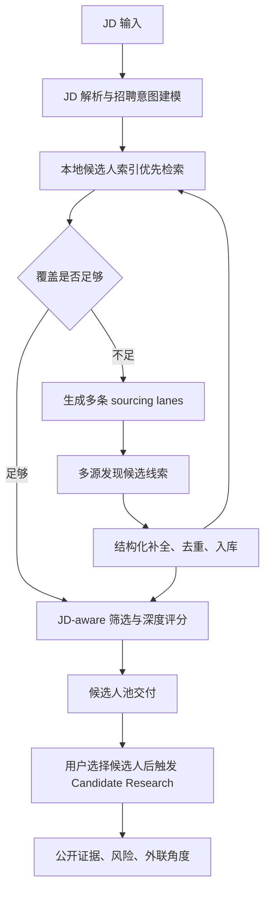

# Hirelix JD 到候选人数据管线方案

**日期**：2026-07-05
**状态**：产品核心架构方案
**适用范围**：外部 sourcing、内部简历/ATS 导入、候选人评估和 Candidate Research

## 核心判断

Hirelix 的核心不是把另一个招聘 SaaS 包一层，也不是只做简历评分工具。核心能力应该是：

> 用户给一个 JD，Hirelix 能把这个 JD 转成一套可控成本、可复用、可解释的候选人发现和评估流程。

数据源是这个产品最关键的环节。正确方向不是随机买全量人才库，也不是实时把 Bright 当语义搜索引擎，而是把外部数据源拆成两层：

1. **发现层**：找到候选人 URL、公开 profile、公司团队页、GitHub/论文/专利/项目页面等线索。
2. **补全层**：把高潜线索补成结构化 candidate profile，入库、去重、向量化、复用。

Bright 仍然可以用，但它的角色必须明确：Bright 是低成本结构化 profile 原料和 LinkedIn URL 补全工具，不是 JD 语义召回大脑。召回策略、语义理解、排序、成本控制和长期索引必须由 Hirelix 自己掌握。

## 端到端流程

这个流程有一个重要原则：每一次外部调用都应该沉淀为本地资产。哪怕这次 JD 只交付 20 个候选人，外部拉回来的 profile、URL、来源、lane 质量和评分结果也要进入本地索引，为下一次相似 JD 降低成本。

## 第 1 步：JD 解析与招聘意图建模

JD 进来后，第一步不是搜索，而是形成结构化招聘意图。当前代码已经有这条主线：

- `src/lib/prompts.ts`：把 JD 解析成 headhunter 视角的 sourcing intelligence。
- `src/lib/llm-schemas.ts`：约束 `hiring_brief`、`headhunter_brief`、`sourcing_plan`、`recall_spec`、`advancement_rubric` 等结构。
- `src/lib/search-jobs.ts` 和 `src/lib/search/pipeline.ts`：执行搜索、筛选、评分、落库。

解析产物必须回答这些问题：

- 这个岗位到底是什么 role family？
- 哪些是硬约束，哪些只是偏好？
- 哪些 title 是正向信号，哪些 title 会误召？
- 哪些技能是区分性技能，而不是同类岗位都会写的泛词？
- 哪些公司/行业/技术栈是猎头会优先打电话的 talent pool？
- 哪些相邻背景是合理 adjacent，哪些会漂移？
- 地理位置是 strict、moderate 还是 flexible？
- 这次搜索应该先窄后宽，还是先宽召再由 LLM 排序？

输出不是一个关键词列表，而是一套 sourcing thesis。后续所有数据源调用都必须服务于这套 thesis。

## 第 2 步：本地索引优先

外部 sourcing 不能每次从零开始烧钱。JD 解析完成后，应该先查 Hirelix 本地资产：

- 历史 Bright snapshot profiles：当前主要在 `hirelix_snapshot_profiles`。
- 历史搜索候选人：`hirelix_candidates`。
- Snapshot 元数据与复用状态：`hirelix_dataset_snapshots`。
- 未来应接入的用户资产：ATS、CSV、简历库、用户手动粘贴的 LinkedIn URL。
- 未来应建设的统一候选人索引：标准化 profile、来源、embedding、更新时间、证据质量和召回历史。

本地优先的目的不是省一点 API 钱，而是形成产品壁垒。竞品能做大规模 sourcing，本质上不是每次实时搜全网，而是维护了长期候选人图谱和可检索索引。

本地检索应该至少支持：

- 结构化过滤：title、company、location、seniority、skills、source、freshness。
- 语义检索：JD / headhunter brief / role mission 与 profile summary 的 embedding match。
- 证据检索：GitHub、论文、项目、专利、个人网站、公开 profile 中的具体证据。
- 去重：LinkedIn URL、姓名+公司、公开链接、邮箱、GitHub、个人网站等。

如果本地已经能返回足够的候选人，外部调用应该减少或跳过。

## 第 3 步：生成 sourcing lanes

不能让 Bright 或 Google 承担 JD 理解。Hirelix 应该把一个 JD 拆成 4 到 8 条 sourcing lanes，每条 lane 都有独立目标、预算、放宽规则和停止条件。

典型 lane：

| Lane | 目标 | 例子 | 风险 |
| --- | --- | --- | --- |
| `primary_exact` | 找最接近 JD 的候选人 | Senior Backend Engineer + payments + NYC | 太窄会 0 召回 |
| `primary_relaxed` | 保留核心工作相似性，放宽 title 或部分技能 | Backend/Platform Engineer + transaction systems | 太宽会噪声上升 |
| `target_company_engineering` | 从相似公司或目标公司找人才 | Stripe、Block、Adyen、Ramp 类公司 | 不能只因公司好就通过 |
| `adjacent_authorized` | 只在 brief 明确允许时找相邻背景 | SRE 转 Platform、Data Infra 转 Backend | 最容易漂移 |
| `exploration` | 小预算探索未知关键词或新来源 | 新技术栈、冷门 title、公司 team page | 只能小额试探 |
| `internal_resume` | 检索用户已有简历/ATS/CSV | 用户上传候选人池 | 数据质量不一 |
| `public_evidence` | 找候选人公开技术证据 | GitHub、论文、博客、speaker page | 覆盖面有限 |

每条 lane 必须有这些字段：

- `lane_kind`
- `target_persona`
- `non_negotiables`
- `relaxed_evidence`
- `exclusion_patterns`
- `initial_budget`
- `max_budget`
- `source_mix`
- `stop_rules`

重要原则：不是一个大过滤器打到底，而是多条小 lane 并行探索。这样才能区分“某条 lane 没数据”和“整个市场没数据”。

## 第 4 步：多源发现候选线索

### Bright Dataset Filter

Bright Filter API 适合结构化拉取 LinkedIn profile 数据。它应该用于：

- 根据 JD 派生出的 title、skill、company、location 小额取数。
- 为每条 lane 拉取 100 到 1,000 条 profile。
- 将返回结果入库，后续复用。
- 做 target company、title family、skill evidence 的结构化召回。

它不适合：

- 直接理解 JD。
- 做自然语言语义排序。
- 用一个极宽过滤器随机拉人。
- 用一组过严 AND 条件期待直接命中最终候选人。

当前实现已经有这些基础：

- `src/lib/brightdata.ts`：Dataset Filter、snapshot 下载、LinkedIn URL scraper。
- `src/lib/search/recall.ts`：Bright recall filters、headhunter lanes、filter chunking。
- `src/lib/search/persistence.ts`：snapshot cache、profiles 持久化。
- `src/lib/search/pipeline.ts`：recall、polling、scoring、adaptive recall。

需要改造的重点是：Bright 结果不应该只服务当前 search job，而应该进入长期候选人索引。

### SERP / X-ray 搜索

Serper、DataForSEO、SearchAPI、SerpApi 这类工具不是候选人数据库，它们是 URL 发现工具。它们适合：

- `site:linkedin.com/in` X-ray 搜索。
- 找候选人的个人网站、GitHub、博客、speaker page。
- 找公司 team page、工程博客作者、会议讲者。
- 用低成本补 Bright 覆盖不到或过滤器不自然表达的搜索。

当前已有 Serper 作为 GitHub identity fallback，但还没有把 SERP 当成独立候选发现层来使用。下一步应抽象出 `DiscoveryProvider`，让 Serper/DataForSEO 可以返回 candidate leads，而不是只服务 GitHub 补证。

### Exa / 语义网页搜索

Exa 适合从公开网页找语义相关的人或页面，例如：

- “distributed systems engineer at fintech wrote about Kafka”
- “ML infrastructure engineer speaker Kubernetes inference”
- “author of blog post on payment ledger reconciliation”

它不适合大规模枚举 LinkedIn profile。Exa 的价值在于发现高质量公开证据和非 LinkedIn 页面，尤其适合技术岗位的 hidden gem。

### Firecrawl / 页面抽取

Firecrawl 不是主搜索引擎，它适合已知 URL 后的页面抽取：

- 公司团队页。
- 工程博客作者页。
- 会议 speaker 页面。
- 个人网站。
- GitHub README 或项目介绍页。

Firecrawl 的输出应该进入 evidence store，而不是直接当候选人 profile。只有当页面能稳定关联到一个人时，才升级为 candidate lead。

### GitHub / OpenAlex / Semantic Scholar / USPTO

这些是领域证据源，不是通用招聘人才库：

- GitHub：开发者、开源贡献、技术栈证据。
- OpenAlex / Semantic Scholar：研究员、ML、学术背景、论文作者。
- USPTO / patents：发明人、硬科技、算法、芯片、系统方向。

这些源可以显著提升候选人判断质量，但覆盖不均匀。它们不能替代 LinkedIn 或 people profile 数据。

### 用户自有数据

用户上传的 ATS、CSV、简历、LinkedIn URL 是必须支持的来源。它的战略意义不是“退而求其次”，而是：

- 降低外部数据成本。
- 让用户已有候选人池被重新发现。
- 把 Hirelix 从单次 sourcing 工具升级为 recruiter 工作台。
- 允许外部 sourcing 和内部 rediscovery 共用同一套 JD-aware ranking。

这部分不能代替外部 sourcing，但必须和外部 sourcing 合并到同一个候选人索引里。

## 第 5 步：补全、标准化和入库

发现层返回的不是最终候选人，而是不同质量的 leads：

- LinkedIn URL。
- 姓名 + 当前公司。
- GitHub URL。
- 个人网站。
- 公司团队页上的人名。
- 论文作者。
- 专利发明人。

补全层负责把 leads 变成统一 candidate profile：

1. 标准化 identity：姓名、当前公司、当前 title、location、profile URL。
2. 合并公开链接：LinkedIn、GitHub、个人网站、论文、博客。
3. 提取结构化经历：公司、职位、时间、技能、教育。
4. 记录来源：provider、query、lane、cost、timestamp、confidence。
5. 计算 freshness：profile 更新时间、来源更新时间、最后验证时间。
6. 生成 embedding：profile summary、experience、skills、evidence。
7. 去重合并：同一人跨来源合并，而不是重复计入候选池。

Bright LinkedIn URL scraper、LinkdAPI、Apify actors 这类工具只能作为补全工具使用。它们可以把已知 URL 变成结构化数据，但不应该替代我们的 sourcing strategy。

## 第 6 步：JD-aware 筛选与排序

候选人召回后，排序不能只看关键词命中。Hirelix 的质量应该来自 JD-aware LLM 判断：

- 对比候选人 profile 和当前 JD。
- 判断 role family 是否一致。
- 判断 seniority、scope、domain、location 是否符合。
- 识别等价经验，而不是只看字面关键词。
- 明确风险，例如 title 相邻但 domain 不足、公司匹配但工作内容不匹配。
- 给出 recruiter 能看懂的 short reasons、risk flags、outreach angles。

这和 `AGENTS.md` 中的候选人质量原则一致：不要用硬编码 title/company/keyword patch 来修质量。确定候选人是否 advance，应该放在 prompt、schema、rubric、eval fixtures 和 scorer 中。

## 第 7 步：自适应扩展

第一次召回后，要做 lane-level 诊断，而不是简单判断“候选人少”：

- 哪条 lane 返回为 0？
- 哪条 lane 太宽，低质量候选人多？
- 哪条 lane 与其他 lane 重复率过高？
- 哪条 lane 命中了人，但评分后几乎无人可联系？
- 是否是 location 太严、title 太窄、skill AND 过多、company list 错误？

如果质量不足，adaptive recall 只能基于明确诊断扩展：

- 放宽 location。
- 增加相邻 title。
- 加入 target company lane。
- 从 SERP/Exa 找非 LinkedIn 线索。
- 对 top leads 做 LinkedIn URL 补全。
- 停止重复、低质量、漂移的 lane。

扩展必须受预算控制。不能因为一次搜索结果差就无限拉 Bright 或 SERP。

## 成本控制原则

成本控制必须从产品设计开始，而不是等账单出来再补救。

每次搜索都应记录：

- `external_spend_estimate`
- `bright_records_requested`
- `bright_records_returned`
- `serp_queries`
- `url_enrichment_count`
- `profiles_inserted`
- `duplicates_removed`
- `candidates_scored`
- `contact_worthy_candidates`
- `cost_per_contact_worthy_candidate`

建议的早期预算模型：

| 场景 | 外部预算 | 策略 |
| --- | ---: | --- |
| 免费/试用搜索 | 0 到 1 美元 | 优先本地缓存、小额 SERP、极小 Bright probe |
| 标准付费搜索 | 3 到 8 美元 | Bright 多 lane + SERP + 少量 URL 补全 |
| 高价值人工验证搜索 | 10 到 20 美元 | 增加 Exa/Firecrawl/target company exploration |
| 内部 benchmark | 单 JD 明确预算上限 | 只为验证供应商效果，不混入常规产品成本 |

Bright Dataset Filter 可以低成本拉结构化 records，但仍必须小额分 lane。SERP 查询通常便宜，但返回的是 URL，不是可评分 profile。URL 补全和第三方 LinkedIn API 要只用于高潜 leads。

## 质量门禁

一条 JD 搜索是否成功，不能只看返回数量。建议用这些指标：

| 指标 | 目标 |
| --- | --- |
| `recall_profile_count` | 是否有足够可评估候选人 |
| `unique_profile_count` | 去重后是否仍足够 |
| `advance_rate` | LLM 判断可推进比例 |
| `contact_worthy_count` | 招聘者真正可能联系的人数 |
| `top_20_precision` | 前 20 个候选人的人工质量 |
| `lane_duplicate_rate` | lane 之间是否高度重复 |
| `lane_drift_rate` | 是否偏离 role family |
| `cost_per_contact_worthy_candidate` | 单个可联系候选人成本 |
| `time_to_first_pool` | 首批候选人可用时间 |

早期 PMF 验证的底线不是“返回 100 人”，而是：

> 对一个真实技术 JD，能稳定交付 3 到 5 个招聘者愿意联系的人。

如果这个指标不稳定，说明数据源和召回策略还没有真正解决。

## 数据源角色表

| 来源 | 角色 | 适合 | 不适合 | 早期优先级 |
| --- | --- | --- | --- | --- |
| Bright Dataset Filter | 结构化 profile 原料 | JD-driven 小额取数、target company、title/skill lanes | 语义召回、随机全量、最终排序 | 高 |
| Bright LinkedIn Scraper | 已知 URL 补全 | 高潜 LinkedIn URL -> JSON | 大规模盲抓 | 中 |
| Serper | Google SERP/X-ray | 快速找 URL、GitHub、个人网站 | 结构化人才库 | 高 |
| DataForSEO | 批量 SERP/X-ray | 后台扩池、低成本批量查询 | 低门槛试错，最低充值更高 | 中高 |
| Brave Search API | 独立搜索索引 | Google 之外的 fallback | 主力大规模搜索，单价偏高 | 中 |
| Exa | 语义网页发现 | 技术文章、公开证据、hidden gem | 大规模枚举 profile | 中 |
| Firecrawl | 页面抽取 | team page、博客、speaker page、个人网站 | 主搜索引擎 | 中 |
| GitHub | 技术证据源 | 开发者、开源、项目经验 | 非技术岗、非开源人群 | 中高 |
| OpenAlex / Semantic Scholar | 学术证据源 | ML、研究、论文背景 | 通用工程招聘 | 低到中 |
| USPTO / patents | 发明证据源 | 深科技、算法、芯片、系统方向 | 普通岗位 | 低 |
| 用户 ATS/CSV/简历 | 内部候选人资产 | rediscovery、低成本评估 | 替代外部 sourcing | 高 |
| 招聘 SaaS 竞品 | 不作为上游 | 竞品研究 | 作为供应商 | 排除 |

## 当前实现与目标差距

当前已经具备：

- JD 解析为 headhunter brief、recall spec、sourcing lanes。
- Bright Dataset Filter recall。
- Bright snapshot cache 和 snapshot profile 持久化。
- Lane audit、round diagnostics、adaptive recall 的雏形。
- Candidate Research 按需补公开证据。
- GitHub / Serper 在技术证据和 identity discovery 上的局部能力。

主要缺口：

1. **缺统一候选人索引**：Bright snapshot profiles 仍偏搜索过程缓存，不是长期 candidate graph。
2. **缺独立发现层**：Serper/DataForSEO/Exa/Firecrawl 还没有作为候选发现 provider 统一接入。
3. **缺 URL lead 到 profile 的分层补全策略**：现在 Bright recall 和 candidate research 更强，lead enrichment pipeline 还不完整。
4. **缺供应商 benchmark**：需要用同一批真实 JD 比较不同 source mix 的成本和质量。
5. **缺成本账本**：需要把外部调用成本统一落到 search、lane、provider、candidate 维度。

## 实施路线

### Phase 0：稳定当前 Bright 召回

目标：把 Bright 从“实时单次召回”改造成“可复用数据资产输入”。

动作：

- 所有 Bright filter 都必须记录 `filter_hash`、lane、budget、returned、duplicates、quality。
- 确保 snapshot profiles 持久化和复用路径稳定。
- 继续维护 Bright guardrail：真实调用会花钱，回归优先 read-only replay。
- 对 10 个真实 JD 跑只读复盘，确认不同 lane 的质量分布。

### Phase 1：接入发现层 provider

目标：把候选发现从 Bright 单源扩展为多源 lead generation。

动作：

- 新增 `DiscoveryProvider` 抽象。
- 第一批接入 Serper、DataForSEO、Exa、Firecrawl。
- 输出统一 `CandidateLead`：name、profile_url、source_url、source_type、snippet、confidence、lane。
- 只对高潜 leads 做结构化补全。
- 每个 provider 都有预算上限和失败降级。

### Phase 2：建设统一候选人索引

目标：让每次外部搜索都沉淀为本地可检索资产。

动作：

- 新增或重构长期 profile index 表。
- 建立 canonical identity 和 cross-source dedupe。
- 为 profile、experience、evidence 建 embedding。
- 支持本地 hybrid retrieval。
- 让 JD 搜索先查本地，再决定是否外部扩展。

### Phase 3：自增长 market map

目标：从单次搜索变成持续增长的人才图谱。

动作：

- 按 role family、location、company cluster 建 market map。
- 对高频岗位后台扩池。
- 记录哪些 source 对哪些岗位有效。
- 让用户行为反哺排序：starred、contacted、replied、submitted、rejected。
- 把数据源选择变成可学习策略，而不是固定规则。

## 明确不做

- 不随机购买大批量 profile 后期待覆盖所有 JD。
- 不把 Bright Filter 当自然语言搜索引擎。
- 不把 HeroHunt、SeekOut、hireEZ、Juicebox 这类招聘 SaaS 当上游供应商。
- 不用硬编码关键词 patch 冒充候选人质量提升。
- 不为了演示效果无限扩大外部调用预算。
- 不把内部简历评测包装成完整 sourcing 能力。

## 需要立刻验证的 benchmark

下一步应该拿 10 个真实 JD 做固定预算 benchmark，而不是继续抽象讨论。

每个 JD 记录：

- Bright-only 结果。
- Bright + Serper 结果。
- Bright + DataForSEO 结果。
- Bright + Exa/Firecrawl 结果。
- 本地缓存命中结果。

每种组合比较：

- 可评估 profile 数量。
- 去重后数量。
- 前 20 质量。
- contact-worthy 数量。
- 每个 contact-worthy candidate 成本。
- 首批结果耗时。
- 是否产生可复用本地资产。

如果在明确预算下，外部 sourcing 不能稳定产生 3 到 5 个招聘者愿意联系的人，那么产品必须转为混合定位：外部 sourcing + 用户自有候选池 + JD-aware 评估排序。反过来，如果 benchmark 能证明稳定产出，就继续强化外部 sourcing 和本地候选人索引。

## 设计结论

Hirelix 的可行路线不是买一个完整人才库，也不是放弃外部 sourcing，而是：

1. JD 先转成 headhunter sourcing thesis。
2. 先查本地候选人索引。
3. 不足时按 sourcing lanes 小额调用多源发现。
4. 只补全高潜 leads。
5. 所有结果入库、去重、向量化、复用。
6. 用 JD-aware LLM scoring 判断候选人，不用关键词 patch。
7. 用 lane-level 质量和成本指标决定是否继续扩展。

这条路线短期不等于 Juicebox/hireEZ 的全量人才库，但它是早期最现实的路线：用可控成本做出可交付结果，同时把每次外部支出转化为 Hirelix 自己的数据资产。
