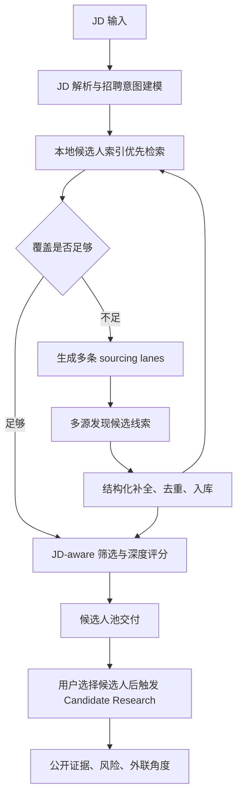
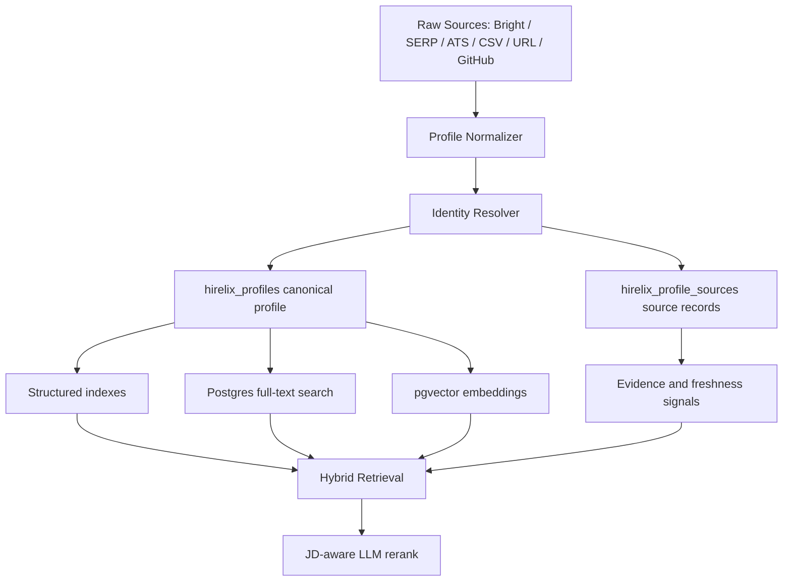
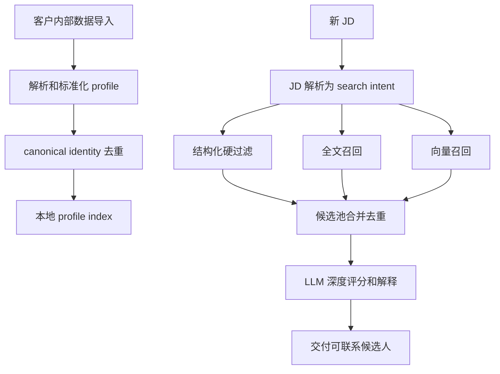

# Hirelix JD 到候选人数据管线方案

**日期**：2026-07-05
**状态**：产品核心架构方案
**适用范围**：外部 sourcing、内部简历/ATS 导入、候选人评估和 Candidate Research

## 本文口径

本文讨论的是 Hirelix **要建设的目标方案**，不是对现有实现的说明。现有数据库表、Bright 缓存和搜索链路只作为迁移约束，不是目标架构本身。

目标系统要解决的问题是：

> 任意一个 JD 进来后，Hirelix 如何从外部数据源和用户内部数据中找到可评估 profile，并用可解释、可控成本、可持续复用的方式交付候选人。

## 核心判断

Hirelix 的核心不是把另一个招聘 SaaS 包一层，也不是只做简历评分工具。核心能力应该是：

> 用户给一个 JD，Hirelix 能把这个 JD 转成一套可控成本、可复用、可解释的候选人发现和评估流程。

数据源是这个产品最关键的环节。正确方向不是随机买全量人才库，也不是实时把 Bright 当语义搜索引擎，而是把外部数据源拆成两层：

1. **发现层**：找到候选人 URL、公开 profile、公司团队页、GitHub/论文/专利/项目页面等线索。
2. **补全层**：把高潜线索补成结构化 candidate profile，入库、去重、向量化、复用。

Bright 仍然可以用，但它的角色必须明确：Bright 是低成本结构化 profile 原料和 LinkedIn URL 补全工具，不是 JD 语义召回大脑。召回策略、语义理解、排序、成本控制和长期索引必须由 Hirelix 自己掌握。

## 必须先钉死的系统边界

这套方案最容易返工的地方，不是向量库或供应商选择，而是系统边界没有提前定义。目标架构必须先固定以下约束：

1. **内部数据和外部数据分开管理**
   - 用户 ATS、CSV、简历、recruiter notes 属于租户私有数据，默认只能服务该租户。
   - 外部公开来源沉淀的 profile 可以进入 Hirelix 公共候选人索引，但必须保留来源、抓取时间、刷新时间和可用范围。
   - 内部数据不能因为参与过一次搜索就被提升为全局共享资产。

2. **Lead、Profile、Candidate 三层概念分开**
   - `CandidateLead`：还没有确认身份的线索，例如 LinkedIn URL、姓名+公司、GitHub URL、team page 上的人名。
   - `CanonicalProfile`：经过身份归并后的长期候选人档案。
   - `SearchCandidate`：某个 profile 在某个 JD 下形成的候选结果和评分。
   - 不能把一次 search 的 candidate 当成长期 profile，也不能把未确认 lead 直接当 profile。

3. **召回够不够必须有门槛**
   - 不能只看返回数量。
   - “覆盖足够”至少要同时满足去重数量、profile 完整度、role-family 匹配率、top-k 质量、来源新鲜度和预算上限。
   - 不满足门槛时才允许外部扩展；满足门槛时应先评分交付。

4. **评分永远是 JD-specific**
   - 不存在全局“好候选人”标签。
   - 历史行为可以作为参考信号，但必须按 role family、seniority、domain、location 等上下文使用。
   - 同一个 profile 可以对一个 JD advance，对另一个 JD reject。

5. **每一次外部调用都要可审计**
   - 记录 provider、query、lane、budget、returned、inserted、deduped、scored、contact-worthy。
   - 记录失败、超时、空召回和低质量召回。
   - 没有成本和质量账本，就无法判断某个来源是否值得继续用。

## 核心数据契约

为了避免后续模块反复返工，目标系统需要先定义稳定的数据契约：

| 对象 | 含义 | 关键字段 |
| --- | --- | --- |
| `CandidateLead` | 发现层产生的候选线索，身份可能未确认 | source_type、source_url、name、company、title、snippet、lane、confidence、raw_payload |
| `CanonicalProfile` | 长期候选人主档案 | profile_id、tenant_scope、visibility_scope、name、current_title、current_company、location、skills、summary、freshness、completeness |
| `ProfileSource` | 某个 profile 的来源记录 | profile_id、provider、source_type、source_url、raw_data、fetched_at、source_confidence、cost_estimate、rights_scope |
| `ProfileIdentity` | 身份归并依据 | profile_id、identity_type、identity_value、confidence、verified_at |
| `ProfileEvidence` | 公开或内部证据 | profile_id、source_url、evidence_type、summary、identity_confidence、relevance_tags、created_at |
| `SearchCandidate` | 某个 JD 下的候选结果 | search_id、profile_id、source_mix、retrieval_scores、llm_score、decision、reasons、risks |

这些对象要比数据库表更稳定。表结构可以演进，但模块之间传递的数据对象不能频繁变。

## 端到端流程



这个流程有一个重要原则：每一次外部调用都应该沉淀为本地资产。哪怕这次 JD 只交付 20 个候选人，外部拉回来的 profile、URL、来源、lane 质量和评分结果也要进入本地索引，为下一次相似 JD 降低成本。

## 第 1 步：JD 解析与招聘意图建模

JD 进来后，第一步不是搜索，而是形成结构化招聘意图。目标系统必须把 JD 转成以下稳定结构：

- `hiring_brief`：岗位核心、硬约束、地理限制、工作模式。
- `headhunter_brief`：猎头视角的 sourcing thesis、相邻背景、误召风险。
- `sourcing_plan`：要跑哪些 sourcing lanes，每条 lane 的目标和预算。
- `recall_spec`：可用于搜索和过滤的 title、skills、company、location、domain terms。
- `advancement_rubric`：候选人是否值得推进的 JD-specific 评判标准。

解析产物必须回答这些问题：

- 这个岗位到底是什么 role family？
- 哪些是硬约束，哪些只是偏好？
- 哪些 title 是正向信号，哪些 title 会误召？
- 哪些技能是区分性技能，而不是同类岗位都会写的泛词？
- 哪些公司/行业/技术栈是猎头会优先打电话的 talent pool？
- 哪些相邻背景是合理 adjacent，哪些会漂移？
- 地理位置是 strict、moderate 还是 flexible？
- 这次搜索应该先窄后宽，还是先宽召再由 LLM 排序？

输出不是一个关键词列表，而是一套 sourcing thesis。后续所有数据源调用都必须服务于这套 thesis。

## 第 2 步：本地索引优先

外部 sourcing 不能每次从零开始烧钱。目标系统应该先查 Hirelix 自己的长期 profile index：

- 外部来源沉淀的 profile：Bright、SERP、Exa、Firecrawl、GitHub、论文、专利等。
- 用户内部资产：ATS、CSV、简历库、用户手动粘贴的 LinkedIn URL。
- 历史搜索资产：曾经召回、评分、被用户操作过的候选人。
- 证据资产：GitHub、博客、论文、项目、专利、个人网站、recruiter notes。
- 质量资产：每个 profile 在不同 JD 下的评分、用户动作、拒绝原因和联系结果。

本地优先的目的不是省一点 API 钱，而是形成产品壁垒。竞品能做大规模 sourcing，本质上不是每次实时搜全网，而是维护了长期候选人图谱和可检索索引。

本地检索应该至少支持：

- 结构化过滤：title、company、location、seniority、skills、source、freshness。
- 语义检索：JD / headhunter brief / role mission 与 profile summary 的 embedding match。
- 证据检索：GitHub、论文、项目、专利、个人网站、公开 profile 中的具体证据。
- 去重：LinkedIn URL、姓名+公司、公开链接、邮箱、GitHub、个人网站等。

如果本地已经能返回足够的候选人，外部调用应该减少或跳过。

## 本地索引如何建立

本地索引不能设计成“某次搜索结果表”，也不能只是“外部原始数据缓存表”。

- 搜索结果表天然绑定某个 JD，不适合作为长期人才库主表。
- 原始缓存表适合重放和审计，但没有 canonical identity、跨来源去重、向量检索和长期质量信号。

因此需要新增一层长期 profile index。早期技术方案应该优先选自托管 PostgreSQL 17，而不是立刻引入外部向量数据库或搜索 SaaS。原因很简单：数据量早期不会大到必须拆出去，Postgres 能同时承载结构化过滤、JSONB、全文检索、pgvector、事务和成本账本，复杂度最低。

推荐架构：



### 建议表结构

核心不是建一张“大 JSON 表”，而是把候选人的稳定身份、来源记录、可检索文本和证据拆开。

| 表 | 作用 | 关键字段 |
| --- | --- | --- |
| `hirelix_profiles` | canonical candidate profile | tenant_scope、visibility_scope、name、current_title、current_company、location、country、seniority、canonical_profile_url、profile_summary、skills、experience_years、freshness_score、completeness_score、last_seen_at、updated_at、deleted_at |
| `hirelix_profile_sources` | 每个 profile 的来源记录 | profile_id、source_type、source_url、provider、raw_data、source_confidence、rights_scope、pii_level、fetched_at、cost_estimate |
| `hirelix_profile_identities` | 跨来源身份归并 | profile_id、identity_type、identity_value、confidence，例如 linkedin_url、linkedin_id、email、github_url、personal_site |
| `hirelix_profile_experiences` | 结构化履历 | profile_id、company、title、start_date、end_date、description、normalized_company、normalized_title |
| `hirelix_profile_evidence` | 公开证据 | profile_id、source_type、source_url、summary、evidence_strength、relevance_tags、identity_confidence |
| `hirelix_profile_embeddings` | 向量索引 | profile_id、embedding_kind、embedding、model、text_hash、updated_at |
| `hirelix_profile_search_stats` | 质量反馈 | profile_id、search_id、lane、score、decision、user_action、created_at |
| `hirelix_search_source_runs` | 每次 provider/lane 调用账本 | search_id、provider、lane、query_hash、budget_limit、requested、returned、inserted、duplicates、cost_estimate、latency_ms、status |

这些表里最关键的是 `hirelix_profiles` 和 `hirelix_profile_sources`。前者是“这个人是谁”，后者是“我们为什么认为这些信息可靠，来自哪里，花了多少钱，什么时候更新过”。

### 租户隔离和可见性

索引必须从第一天支持可见性范围，否则内部数据和外部数据会混在一起，后面很难拆。

| 范围 | 含义 | 使用规则 |
| --- | --- | --- |
| `tenant_private` | 客户内部 ATS、CSV、简历、notes | 只能该租户检索和评分，不能进入全局池 |
| `workspace_shared` | 同一团队/工作区共享候选人 | 只在该团队内复用 |
| `global_public` | 外部公开来源 profile | 可进入 Hirelix 公共索引，但必须保留来源和刷新状态 |
| `restricted` | 来源或字段存在限制 | 只允许审计、补全或特定流程使用 |

PII 字段要单独标记，例如 email、phone、私人地址。候选人 profile 可以进入检索索引，不代表所有联系方式都可以进入默认展示或全局复用。

### 身份归并规则

身份合并是本地索引最大的工程坑之一。错误合并会比漏合并更严重，因为它会污染候选人档案和评分结果。

归并策略：

1. **强身份直接合并**
   - 同一 LinkedIn URL / LinkedIn ID。
   - 同一 verified email。
   - 同一 GitHub URL 且 profile 与姓名/公司/个人网站互相印证。

2. **弱身份只进入候选 cluster**
   - 姓名 + 当前公司。
   - 姓名 + title + location。
   - 个人网站与社交链接互相引用但姓名不完全一致。

3. **禁止自动合并**
   - 仅凭姓名。
   - 仅凭姓名 + 模糊公司名。
   - 仅凭 LLM 判断“看起来像同一个人”。

4. **合并必须可回滚**
   - 保留 source records。
   - 保留 identity evidence。
   - 支持拆分 profile。
   - 搜索评分使用 merge 后 profile，但审计时能追溯到原始来源。

### 索引技术选择

早期推荐用 Postgres 做 hybrid retrieval：

0. **数据库扩展**
   - `pgvector`：profile embedding 检索。
   - `pg_trgm`：姓名、公司、title 的模糊匹配和去重辅助。
   - Postgres 内置全文检索：`tsvector` / `tsquery` / `ts_rank`。

1. **结构化索引**
   - B-tree：country、current_company、current_title、last_seen_at。
   - GIN：skills array、JSONB metadata。
   - trigram：姓名、公司、title 模糊匹配。

2. **全文检索**
   - 用 Postgres `tsvector` 建 `search_document`。
   - 内容包括 headline、current title、experience titles、company names、skills、profile summary、evidence summary。
   - 用 `ts_rank` 做关键词召回，解决 title/skill/company 的硬匹配。

3. **向量检索**
   - 用 `pgvector` 存 embedding。
   - 至少三类 embedding：
     - `profile_summary`：整个人的职业画像。
     - `experience_evidence`：经历和项目证据。
     - `public_evidence`：GitHub、论文、博客、专利等公开证据。
   - 用 HNSW 或 ivfflat 索引，早期优先 HNSW，便于增量写入和查询。

4. **质量和新鲜度排序**
   - 不只看相似度，还要加 freshness、source confidence、profile completeness、historical recruiter action。
   - 旧数据不能直接删除，但要降权或触发刷新。

这不是“向量搜索替代数据库”。正确做法是 hybrid retrieval：结构化过滤 + 全文检索 + 向量召回 + LLM rerank。

### Hybrid retrieval 的目标算法

JD 进来后，本地检索不应该只跑一个 query。目标算法应按多路召回合并：

1. **Hard filter**
   - 租户范围、可见性、删除状态、基础地点、工作模式、明显 seniority。
   - 只处理确定性约束；技能和 title 不应该全部硬 AND。

2. **Lexical retrieval**
   - title variants、company terms、domain terms、must-have terms 走 `tsvector` / trigram。
   - 解决“profile 明确写了这个词”的候选人。

3. **Semantic retrieval**
   - `role_mission`、`same_work_proof`、`equivalent_evidence` 生成 query embedding。
   - 解决 title 不完全一致但工作内容相似的人。

4. **Evidence retrieval**
   - 针对 GitHub、论文、博客、专利、个人网站 evidence 单独召回。
   - 只作为候选补强或 hidden-gem 来源，不直接替代主 profile。

5. **Merge and dedupe**
   - 每路取 top 100 到 300。
   - 合并后按 profile_id 去重。
   - 保留每一路的命中原因，供 LLM 判断和 UI 解释。

6. **Pre-rank**
   - 用结构化分、全文分、向量分、证据分、freshness、source confidence、completeness 合成初筛分。
   - DeepSeek v4 flash 和缓存命中后，LLM 轻筛可以更积极，默认送入 top 100 到 300；高价值搜索可以扩大到 500。
   - 深度评分仍应聚焦 top 30 到 80，因为深评不只是 token 成本，还涉及延迟、解释质量和 UI 可读性。

这个分层很重要。不是因为 LLM 一定贵，而是因为 LLM 不能替代召回和索引：如果检索没有把人召回来，LLM 看不到；如果候选池过大，主要问题会变成延迟、上下文压缩、重复 profile、脏数据和解释质量。

### 覆盖是否足够的判定

端到端流程里的“覆盖是否足够”必须是一个质量门，而不是人工感觉。

建议默认门槛：

| 维度 | 早期建议门槛 |
| --- | --- |
| 去重 profile 数 | 至少 80 到 150 个可评估 profile |
| 完整度 | 至少 60% profile 有 current title、company、location、experience summary |
| role-family 初筛通过率 | top 100 中至少 35% 通过轻筛 |
| contact-worthy 预估 | top 30 中至少 5 个可能值得联系 |
| 来源新鲜度 | top 50 中过期或低置信来源不超过 40% |
| 外部预算 | 没超过当前 plan/search 的预算上限 |

如果本地检索达不到这些门槛，再进入外部扩展。外部扩展也不是一次性全开，而是按 lane 小额 probe，只有 probe 结果质量足够时才扩大。

## 纯内部数据场景：JD 如何直接拿到 Profile

如果完全不做外部召回，只使用客户已有 ATS、CSV、简历库、历史候选人、手动 LinkedIn URL，那么产品仍然可以成立，但定位会变成：

> JD-aware candidate rediscovery and evaluation，而不是完整外部 sourcing。

这个模式的流程是：



内部数据导入后，每个 profile 都要生成一个用于检索的标准文本，例如：

```text
Name: ...
Current title: ...
Current company: ...
Location: ...
Seniority: ...
Skills: ...
Experience:
- Company / title / scope / projects / domain
Evidence:
- GitHub / publications / notes / recruiter tags
```

JD 来了以后，不是让 LLM 在全库里“看一遍”，而是先用检索拿候选池：

1. **硬过滤**
   - 地点、远程/onsite、当前或历史公司、明显 seniority、排除行业。
   - 硬过滤只能用于确定性约束，不能把技能关键词全部 AND 起来。

2. **全文召回**
   - 用 JD 中的 title variants、core skills、domain terms、target companies 生成 tsquery。
   - 适合找字面上写了相关 title/skill/company 的人。

3. **向量召回**
   - 用 `headhunter_brief.role_mission`、`same_work_proof`、`equivalent_evidence` 生成 query embedding。
   - 适合找 title 不完全一样但工作本质相似的人。

4. **多路合并**
   - 每一路取 top 100 到 300。
   - union 去重后得到 300 到 800 个候选人。
   - 用轻量模型/规则做第一轮筛选，再用 judge 做深度评分。

5. **LLM rerank**
   - LLM 不负责全库搜索，只负责对检索后的候选池做 JD-aware 判断。
   - 输出 advance/reject、原因、风险和外联角度。

内部数据模式的关键优势是成本低、速度快、可控；关键弱点是覆盖完全取决于客户已有数据。如果客户库里没有这类人，再强的索引也找不到。产品上必须清楚显示：

- `Internal matches found`
- `External expansion recommended`
- `No matching profiles in your current database`

不能把“内部库无候选人”包装成模型能力不足。

### 内部索引的最小可行版本

MVP 不需要一开始做复杂人才图谱。可以分三步：

1. **Profile ingestion**
   - 支持 CSV、简历文本、LinkedIn URL、ATS export。
   - 标准化成 canonical profile。
   - 做基础去重。

2. **Hybrid retrieval**
   - Postgres structured filters。
   - Postgres full-text search。
   - pgvector embedding search。

3. **JD-aware scoring**
   - 使用 JD 解析出的 `headhunter_brief`、`advancement_rubric` 和统一 scoring pipeline。
   - 把内部召回 profile 转成和 Bright profile 相同的 candidate input。

这样就能实现：用户上传 5,000 到 50,000 个内部候选人后，给一个 JD，系统在几十秒内返回最相关的一批 profile，并解释为什么匹配或不匹配。

### 内部导入的坑

内部数据不是天然干净的数据源。ATS、CSV 和简历库通常会有大量重复、过期、字段缺失和历史状态噪声。

必须处理这些问题：

- **重复候选人**：同一个人在多个 ATS 导出、CSV、简历版本和 LinkedIn URL 中重复出现。
- **过期履历**：内部简历可能停留在几年前，需要通过 source freshness 降权。
- **字段缺失**：很多简历没有标准 skills、location、current company，需要 normalizer 补齐。
- **历史状态污染**：某个候选人曾被某客户拒绝，不代表对另一个 JD 不合适。
- **租户私有备注**：recruiter notes 只能在该租户内使用，不能进入全局 profile。
- **联系方式治理**：email/phone 等 PII 不能因为检索命中就默认展示或跨租户复用。

因此内部 ingestion 必须是幂等、可重跑、可回滚的 pipeline：

1. 原始文件入库，计算 file hash。
2. 每条记录计算 source record hash。
3. normalize 成 `CandidateLead`。
4. identity resolution 归并到 `CanonicalProfile`。
5. 生成 `search_document` 和 embeddings。
6. 写入 source、identity、evidence、embedding、audit logs。
7. 支持删除、重导入和字段刷新。

## 第 3 步：生成 sourcing lanes

不能让 Bright 或 Google 承担 JD 理解。Hirelix 应该把一个 JD 拆成 4 到 8 条 sourcing lanes，每条 lane 都有独立目标、预算、放宽规则和停止条件。

典型 lane：

| Lane | 目标 | 例子 | 风险 |
| --- | --- | --- | --- |
| `primary_exact` | 找最接近 JD 的候选人 | Senior Backend Engineer + payments + NYC | 太窄会 0 召回 |
| `primary_relaxed` | 保留核心工作相似性，放宽 title 或部分技能 | Backend/Platform Engineer + transaction systems | 太宽会噪声上升 |
| `target_company_engineering` | 从相似公司或目标公司找人才 | Stripe、Block、Adyen、Ramp 类公司 | 不能只因公司好就通过 |
| `adjacent_authorized` | 只在 brief 明确允许时找相邻背景 | SRE 转 Platform、Data Infra 转 Backend | 最容易漂移 |
| `exploration` | 小预算探索未知关键词或新来源 | 新技术栈、冷门 title、公司 team page | 只能小额试探 |
| `internal_resume` | 检索用户已有简历/ATS/CSV | 用户上传候选人池 | 数据质量不一 |
| `public_evidence` | 找候选人公开技术证据 | GitHub、论文、博客、speaker page | 覆盖面有限 |

每条 lane 必须有这些字段：

- `lane_kind`
- `target_persona`
- `non_negotiables`
- `relaxed_evidence`
- `exclusion_patterns`
- `initial_budget`
- `max_budget`
- `source_mix`
- `stop_rules`

重要原则：不是一个大过滤器打到底，而是多条小 lane 并行探索。这样才能区分“某条 lane 没数据”和“整个市场没数据”。

## 第 4 步：多源发现候选线索

### Bright Dataset Filter

Bright Filter API 适合结构化拉取 LinkedIn profile 数据。目标系统里它应该用于：

- 根据 JD 派生出的 title、skill、company、location 小额取数。
- 为每条 lane 拉取 100 到 1,000 条 profile。
- 将返回结果入库，后续复用。
- 做 target company、title family、skill evidence 的结构化召回。

它不适合：

- 直接理解 JD。
- 做自然语言语义排序。
- 用一个极宽过滤器随机拉人。
- 用一组过严 AND 条件期待直接命中最终候选人。

目标系统需要具备这些能力：

- Dataset Filter 调用、snapshot 下载、失败重试。
- LinkedIn URL scraper，用于高潜 URL 的结构化补全。
- Filter hash 和 snapshot cache，用于复用相同或相似拉取。
- Lane-level budget、returned、duplicates、quality 记录。
- Bright record 到 canonical profile index 的写入。

设计重点是：Bright 结果不应该只服务当前 search job，而应该进入长期候选人索引。

Bright 的使用必须遵守 probe-then-expand：

1. 每条 lane 先小额 probe，例如 50 到 200 条。
2. 轻筛判断返回 profile 的 role-family 匹配率、重复率、完整度和来源新鲜度。
3. 只有质量达标的 lane 才扩大到 300 到 1,000 条。
4. 低质量、重复率高或漂移的 lane 立即停止。

这样可以避免两个极端：严格过滤导致 0 召回，宽泛过滤导致花钱买噪声。

### SERP / X-ray 搜索

Serper、DataForSEO、SearchAPI、SerpApi 这类工具不是候选人数据库，它们是 URL 发现工具。它们适合：

- `site:linkedin.com/in` X-ray 搜索。
- 找候选人的个人网站、GitHub、博客、speaker page。
- 找公司 team page、工程博客作者、会议讲者。
- 用低成本补 Bright 覆盖不到或过滤器不自然表达的搜索。

目标系统应抽象出 `DiscoveryProvider`，让 Serper/DataForSEO 可以返回 candidate leads，而不是只服务 GitHub 补证。

### Exa / 语义网页搜索

Exa 适合从公开网页找语义相关的人或页面，例如：

- “distributed systems engineer at fintech wrote about Kafka”
- “ML infrastructure engineer speaker Kubernetes inference”
- “author of blog post on payment ledger reconciliation”

它不适合大规模枚举 LinkedIn profile。Exa 的价值在于发现高质量公开证据和非 LinkedIn 页面，尤其适合技术岗位的 hidden gem。

### Firecrawl / 页面抽取

Firecrawl 不是主搜索引擎，它适合已知 URL 后的页面抽取：

- 公司团队页。
- 工程博客作者页。
- 会议 speaker 页面。
- 个人网站。
- GitHub README 或项目介绍页。

Firecrawl 的输出应该进入 evidence store，而不是直接当候选人 profile。只有当页面能稳定关联到一个人时，才升级为 candidate lead。

### GitHub / OpenAlex / Semantic Scholar / USPTO

这些是领域证据源，不是通用招聘人才库：

- GitHub：开发者、开源贡献、技术栈证据。
- OpenAlex / Semantic Scholar：研究员、ML、学术背景、论文作者。
- USPTO / patents：发明人、硬科技、算法、芯片、系统方向。

这些源可以显著提升候选人判断质量，但覆盖不均匀。它们不能替代 LinkedIn 或 people profile 数据。

### 用户自有数据

用户上传的 ATS、CSV、简历、LinkedIn URL 是必须支持的来源。它的战略意义不是“退而求其次”，而是：

- 降低外部数据成本。
- 让用户已有候选人池被重新发现。
- 把 Hirelix 从单次 sourcing 工具升级为 recruiter 工作台。
- 允许外部 sourcing 和内部 rediscovery 共用同一套 JD-aware ranking。

这部分不能代替外部 sourcing，但必须和外部 sourcing 合并到同一个候选人索引里。

## 第 5 步：补全、标准化和入库

发现层返回的不是最终候选人，而是不同质量的 leads：

- LinkedIn URL。
- 姓名 + 当前公司。
- GitHub URL。
- 个人网站。
- 公司团队页上的人名。
- 论文作者。
- 专利发明人。

补全层负责把 leads 变成统一 candidate profile：

1. 标准化 identity：姓名、当前公司、当前 title、location、profile URL。
2. 合并公开链接：LinkedIn、GitHub、个人网站、论文、博客。
3. 提取结构化经历：公司、职位、时间、技能、教育。
4. 记录来源：provider、query、lane、cost、timestamp、confidence。
5. 计算 freshness：profile 更新时间、来源更新时间、最后验证时间。
6. 生成 embedding：profile summary、experience、skills、evidence。
7. 去重合并：同一人跨来源合并，而不是重复计入候选池。

Bright LinkedIn URL scraper、LinkdAPI、Apify actors 这类工具只能作为补全工具使用。它们可以把已知 URL 变成结构化数据，但不应该替代我们的 sourcing strategy。

## 第 6 步：JD-aware 筛选与排序

候选人召回后，排序不能只看关键词命中。Hirelix 的质量应该来自 JD-aware LLM 判断：

- 对比候选人 profile 和当前 JD。
- 判断 role family 是否一致。
- 判断 seniority、scope、domain、location 是否符合。
- 识别等价经验，而不是只看字面关键词。
- 明确风险，例如 title 相邻但 domain 不足、公司匹配但工作内容不匹配。
- 给出 recruiter 能看懂的 short reasons、risk flags、outreach angles。

候选人质量不能靠硬编码 title/company/keyword patch 来修。确定候选人是否 advance，应该放在 prompt、schema、rubric、eval fixtures 和 scorer 中。

评分也必须分层：

| 阶段 | 输入规模 | 目标 | 方法 |
| --- | ---: | --- | --- |
| Pre-rank | 300 到 2,000 | 降低候选池规模 | 结构化分、全文分、向量分、freshness、source confidence |
| Light screen | 100 到 300，必要时 500 | 排除明显不相关 | DeepSeek v4 flash + 缓存 + 短上下文判断 |
| Deep score | 30 到 80 | 形成可交付解释 | JD-aware judge、risk flags、outreach angles |
| Human QA / eval | 抽样或 beta 阶段 | 校准质量 | 人工检查 top 20 和 rejected samples |

不要让 LLM 做全库搜索，但也不要过度节省 LLM。LLM 的作用是在检索后的候选池里做判断、解释、排序、lane 诊断和 profile 标准化。只要召回候选池进入了合理范围，DeepSeek v4 flash 应该按质量优先使用，而不是为了节省几美分过早压缩判断规模。

### LLM 使用策略

默认模型按 DeepSeek v4 flash 设计，并假设 profile、JD 解析、rubric 和 light-screen prompt 有较高缓存命中率。DeepSeek 在 [V4 Preview Release](https://api-docs.deepseek.com/news/news260424) 中把 V4 Flash 定位为 fast、efficient、economical，并且 V4 API 支持 1M context。这个前提下，LLM 不应被当成稀缺资源，而应作为质量层积极使用。产品策略应该是：外部数据和召回覆盖精打细算，LLM 判断层质量优先。

适合大量使用 LLM 的环节：

- JD 解析：生成 `hiring_brief`、`headhunter_brief`、`sourcing_plan`、`advancement_rubric`。
- Query/lane 生成：把 JD 转成多条 sourcing lanes 和 provider-specific queries。
- Profile normalization：把简历、CSV、Bright record、公开网页整理成 canonical profile。
- Light screen：对 top 100 到 300 候选人做快速 JD-aware 判断。
- Lane diagnosis：判断某条 lane 是太窄、太宽、漂移、重复还是质量不足。
- Explanation：为 top candidates 生成短理由、风险和 outreach angle。

不适合交给 LLM 的环节：

- 全库扫描。
- 身份强合并的唯一依据。
- 预算控制。
- 租户可见性判断。
- PII 展示权限判断。
- 数据源是否继续扩张的唯一依据。

因此，LLM 成本不是当前最应该恐惧的点。真正的边界是：先用索引和 provider 把候选人召回来，再让 DeepSeek v4 flash 低成本、大批量地做判断和解释。

### LLM 并发和调度判断

按 2026-07-05 [DeepSeek 官方 Rate Limit & Isolation 文档](https://api-docs.deepseek.com/quick_start/rate_limit)，账号级默认并发为：

| 模型 | 官方默认并发 |
| --- | ---: |
| `deepseek-v4-flash` | `2500` |
| `deepseek-v4-pro` | `500` |

官方文档还说明，如果业务需要更高并发，可以提交 capacity expansion request，DeepSeek 会按实际业务需求匹配并发，扩容没有额外费用。这个限制是账号级别隔离，不是简单靠多建 API key 绕开。

这意味着 Hirelix 的 LLM 策略可以按质量优先设计：

- `deepseek-v4-flash` 可以承担大批量 light screen、normalization、lane diagnosis。
- `deepseek-v4-pro` 只用于少量 conflict review / arbiter。
- 系统内部仍要保留队列、重试、429 处理和 per-user 调度隔离，但这主要是可靠性工程，不是成本或并发能力不足。
- 对美国招聘用户的实时搜索，不应该因为担心 DeepSeek 成本或并发而过早压缩候选池；更应该优先保证 top-k 质量。
- 默认阈值可以更激进：标准搜索 light screen 300 人不应被视为奢侈，高价值搜索扩大到 500 到 1,000 人也应先看延迟和交付质量，而不是先看 token 账单。

### LLM 价格预估

按 2026-07-05 [DeepSeek 官方 API 价格页](https://api-docs.deepseek.com/quick_start/pricing)估算：

| 模型 | Cache hit input | Cache miss input | Output |
| --- | ---: | ---: | ---: |
| `deepseek-v4-flash` | `$0.0028 / 1M tokens` | `$0.14 / 1M tokens` | `$0.28 / 1M tokens` |
| `deepseek-v4-pro` | `$0.003625 / 1M tokens` | `$0.435 / 1M tokens` | `$0.87 / 1M tokens` |

这个估算按当前官方价格/非峰值原价计算。即使 DeepSeek 对北京时间峰值时段加价，Hirelix 面向美国招聘用户的主要实时使用时段大概率落在北京时间夜间或清晨：

- 美国东部工作日 9:00-17:00，大约对应北京时间 21:00-05:00。
- 美国西部工作日 9:00-17:00，大约对应北京时间 00:00-08:00。

因此，美国用户实时搜索大概率不受北京时间白天峰值加价影响。真正需要控制的是后台批处理、benchmark、批量 re-index、批量 profile normalization，不要默认排在北京时间 9:00-12:00 或 14:00-18:00 这类峰值窗口。

成本公式：

```text
llm_cost =
  cached_input_tokens / 1_000_000 * cache_hit_price
+ cache_miss_input_tokens / 1_000_000 * cache_miss_price
+ output_tokens / 1_000_000 * output_price
```

估算前提：

- 主要模型使用 `deepseek-v4-flash`。
- `deepseek-v4-pro` 只用于少量 arbiter / conflict review。
- JD 解析 prompt、rubric、light-screen system prompt、profile schema 有稳定缓存命中。
- profile 内容本身通常是 cache miss，所以 profile 越长，成本越接近 miss input 价格。
- 以下估算只算 LLM，不包含 Bright、SERP、URL scraper、数据库和队列成本。

| 场景 | 典型 LLM 工作量 | 估算成本 / search | 判断 |
| --- | --- | ---: | --- |
| Internal-only 小搜索 | JD 解析 + 150 light screen + 30 deep score | `$0.04` 左右 | 几乎不是成本瓶颈 |
| 标准混合搜索 | JD 解析 + 100 新 profile normalize + 300 light screen + 60 deep score + lane diagnosis | `$0.12` 左右 | 可以大胆使用 |
| 激进标准搜索 | JD 解析 + 300 新 profile normalize + 500 light screen + 100 deep score + 20 pro arbiter | `$0.32` 左右 | 仍低于多数外部数据成本 |
| 高召回验证搜索 | JD 解析 + 500 新 profile normalize + 1000 light screen + 150 deep score + 40 pro arbiter | `$0.58` 左右 | 适合 benchmark 或高价值搜索 |

这些数字说明，DeepSeek 这一层不应该按“省钱优先”设计。哪怕高召回验证搜索的 LLM 成本接近 `$0.58/search`，它仍然很可能低于外部 profile 数据、SERP、URL 抓取、人工校验或失败搜索带来的真实成本。对 Hirelix 这种质量敏感的招聘产品，LLM 的角色应该是提高候选池可用率，而不是成为候选池规模的第一道刹车。

如果某些请求不得不落在 DeepSeek 峰值加价窗口，可以做 2x 敏感性估算：

| 场景 | 原价估算 | 峰值 2x 敏感性 |
| --- | ---: | ---: |
| Internal-only 小搜索 | `$0.04` | `$0.08` |
| 标准混合搜索 | `$0.12` | `$0.24` |
| 激进标准搜索 | `$0.32` | `$0.64` |
| 高召回验证搜索 | `$0.58` | `$1.16` |

结论：

- LLM 成本不是当前主瓶颈；外部数据源、URL/profile 补全和召回覆盖更关键。
- 可以把 DeepSeek v4 flash 用得更积极，尤其是 light screen、profile normalization、lane diagnosis、解释生成。
- 面向美国招聘用户的实时流量大概率落在北京时间非峰值窗口，峰值加价对产品常规使用影响有限。
- 后台批处理和 benchmark 应支持按北京时间非峰值窗口调度，避免不必要的峰值成本。
- 仍然不能让 LLM 替代索引和召回，因为 LLM 只能判断已经进入候选池的人。
- 真正需要控制的是 deep score 的规模、并发延迟、缓存命中率和 profile 输入长度；这些控制目标是稳定性和质量，不是简单压低 token 支出。
- 产品成本核算里，LLM 和外部数据必须分账：`llm_cost_per_search`、`external_data_cost_per_search`、`cost_per_contact_worthy_candidate` 分开看。

## 第 7 步：自适应扩展

第一次召回后，要做 lane-level 诊断，而不是简单判断“候选人少”：

- 哪条 lane 返回为 0？
- 哪条 lane 太宽，低质量候选人多？
- 哪条 lane 与其他 lane 重复率过高？
- 哪条 lane 命中了人，但评分后几乎无人可联系？
- 是否是 location 太严、title 太窄、skill AND 过多、company list 错误？

如果质量不足，adaptive recall 只能基于明确诊断扩展：

- 放宽 location。
- 增加相邻 title。
- 加入 target company lane。
- 从 SERP/Exa 找非 LinkedIn 线索。
- 对 top leads 做 LinkedIn URL 补全。
- 停止重复、低质量、漂移的 lane。

扩展必须受预算控制。不能因为一次搜索结果差就无限拉 Bright 或 SERP。

## 成本控制原则

成本控制必须从产品设计开始，而不是等账单出来再补救。这里的“成本”主要指外部数据源成本和补全成本；LLM 成本在 DeepSeek v4 flash + 缓存前提下可以更积极使用，但仍然要记录延迟、调用量和缓存命中率。

每次搜索都应记录：

- `external_spend_estimate`
- `bright_records_requested`
- `bright_records_returned`
- `serp_queries`
- `url_enrichment_count`
- `profiles_inserted`
- `duplicates_removed`
- `candidates_scored`
- `contact_worthy_candidates`
- `cost_per_contact_worthy_candidate`
- `llm_calls_by_stage`
- `llm_cache_hit_rate`
- `llm_latency_ms_by_stage`

建议的早期预算模型：

| 场景 | 外部预算 | 策略 |
| --- | ---: | --- |
| 免费/试用搜索 | 0 到 1 美元 | 优先本地缓存、小额 SERP、极小 Bright probe |
| 标准付费搜索 | 3 到 8 美元 | Bright 多 lane + SERP + 少量 URL 补全 |
| 高价值人工验证搜索 | 10 到 20 美元 | 增加 Exa/Firecrawl/target company exploration |
| 内部 benchmark | 单 JD 明确预算上限 | 只为验证供应商效果，不混入常规产品成本 |

Bright Dataset Filter 可以低成本拉结构化 records，但仍必须小额分 lane。SERP 查询通常便宜，但返回的是 URL，不是可评分 profile。URL 补全和第三方 LinkedIn API 要只用于高潜 leads。

LLM 预算要和外部数据预算分开看。外部数据预算决定“能不能找到更多人”；LLM 预算主要决定“能不能更好地理解、筛选和解释已经找到的人”。不要因为 LLM 便宜就放松外部数据源质量，也不要因为外部数据贵就把召回问题推给 LLM。

### 预算分配器

目标系统应该有统一 `SearchBudgetAllocator`，不能让各 provider 自己决定花多少钱。

预算分配顺序：

1. **免费/沉没成本优先**
   - 本地 profile index。
   - 用户内部数据。
   - 已有 source/evidence cache。

2. **低成本发现**
   - SERP / DataForSEO / Serper 小额 URL discovery。
   - GitHub / OpenAlex / Semantic Scholar 等低成本证据源。

3. **结构化 profile 拉取**
   - Bright Dataset Filter 按 lane probe。
   - 只扩大质量达标的 lane。

4. **高成本补全**
   - LinkedIn URL scraper、LinkdAPI、Apify actors。
   - 只处理 top leads，不做全量补全。

每个 search 都要有硬预算上限；每个 lane 也要有硬预算上限。超过预算时系统应该返回“当前预算下的最佳结果 + 是否建议继续扩展”，而不是静默继续花钱。

## 质量门禁

一条 JD 搜索是否成功，不能只看返回数量。建议用这些指标：

| 指标 | 目标 |
| --- | --- |
| `recall_profile_count` | 是否有足够可评估候选人 |
| `unique_profile_count` | 去重后是否仍足够 |
| `advance_rate` | LLM 判断可推进比例 |
| `contact_worthy_count` | 招聘者真正可能联系的人数 |
| `top_20_precision` | 前 20 个候选人的人工质量 |
| `lane_duplicate_rate` | lane 之间是否高度重复 |
| `lane_drift_rate` | 是否偏离 role family |
| `cost_per_contact_worthy_candidate` | 单个可联系候选人成本 |
| `time_to_first_pool` | 首批候选人可用时间 |

早期 PMF 验证的底线不是“返回 100 人”，而是：

> 对一个真实技术 JD，能稳定交付 3 到 5 个招聘者愿意联系的人。

如果这个指标不稳定，说明数据源和召回策略还没有真正解决。

质量门禁必须同时看 accepted 和 rejected 样本。只看 top candidates 会掩盖召回过宽的问题；只看 rejected 又会误判系统没有价值。

每次 beta 搜索至少抽查：

- top 20 候选人。
- light screen 通过但 deep score 未入选的 20 人。
- 被 hard filter 或 light screen 拒绝的 20 人。
- 每条 lane 的前 10 人。

这样才能判断问题到底在数据源、检索、身份合并、评分 prompt，还是 JD 解析。

## 数据源角色表

| 来源 | 角色 | 适合 | 不适合 | 早期优先级 |
| --- | --- | --- | --- | --- |
| Bright Dataset Filter | 结构化 profile 原料 | JD-driven 小额取数、target company、title/skill lanes | 语义召回、随机全量、最终排序 | 高 |
| Bright LinkedIn Scraper | 已知 URL 补全 | 高潜 LinkedIn URL -> JSON | 大规模盲抓 | 中 |
| Serper | Google SERP/X-ray | 快速找 URL、GitHub、个人网站 | 结构化人才库 | 高 |
| DataForSEO | 批量 SERP/X-ray | 后台扩池、低成本批量查询 | 低门槛试错，最低充值更高 | 中高 |
| Brave Search API | 独立搜索索引 | Google 之外的 fallback | 主力大规模搜索，单价偏高 | 中 |
| Exa | 语义网页发现 | 技术文章、公开证据、hidden gem | 大规模枚举 profile | 中 |
| Firecrawl | 页面抽取 | team page、博客、speaker page、个人网站 | 主搜索引擎 | 中 |
| GitHub | 技术证据源 | 开发者、开源、项目经验 | 非技术岗、非开源人群 | 中高 |
| OpenAlex / Semantic Scholar | 学术证据源 | ML、研究、论文背景 | 通用工程招聘 | 低到中 |
| USPTO / patents | 发明证据源 | 深科技、算法、芯片、系统方向 | 普通岗位 | 低 |
| 用户 ATS/CSV/简历 | 内部候选人资产 | rediscovery、低成本评估 | 替代外部 sourcing | 高 |
| 招聘 SaaS 竞品 | 不作为上游 | 竞品研究 | 作为供应商 | 排除 |

## 关键风险和规避策略

| 风险 | 会造成什么问题 | 规避策略 |
| --- | --- | --- |
| 内部数据和外部数据混用 | 客户数据泄露、信任崩盘 | 从第一天做 `tenant_scope` / `visibility_scope`，内部数据默认私有 |
| 身份误合并 | profile 被污染，评分失真 | 强身份自动合并，弱身份只进 cluster，所有合并可回滚 |
| 向量召回过度依赖 | 语义相似但岗位不匹配 | hybrid retrieval，结构化硬约束和 LLM judge 兜底 |
| Bright lane 过宽 | 花钱买噪声 | probe-then-expand，低质量 lane 自动停止 |
| Bright lane 过窄 | 0 召回 | 多 lane 小额探索，避免技能/title 全部 AND |
| SERP 结果不可评分 | 只有 URL，没有 profile | SERP 只做 discovery，高潜 lead 才补全 |
| LLM 深评过多候选人 | 延迟、上下文压缩和解释质量失控 | DeepSeek v4 flash 可扩大 light screen，但 deep score 仍分层 |
| 历史用户行为污染 | 某 JD 的拒绝影响另一个 JD | 所有质量标签都按 JD / role family / context 存储 |
| benchmark 数据泄漏 | 误判供应商或 warm index 效果 | cold/warm 分开测，provider 结果隔离，盲评 top candidates |
| 数据过期 | 搜到的人已经换岗或信息失效 | freshness score、last_seen_at、source refresh、过期降权 |
| PII 展示不当 | 合规和信任风险 | PII 单独标记，按权限展示，不随 profile 默认全局复用 |

## 目标建设模块

目标方案拆成六个模块：

1. **Profile Index**：长期候选人主索引，承载 canonical profile、来源、身份、经历、证据和 embedding。
2. **Internal Ingestion**：ATS、CSV、简历、LinkedIn URL、recruiter notes 的导入和标准化。
3. **Hybrid Retrieval**：结构化过滤、全文检索、向量检索、多路合并去重。
4. **External Discovery**：Bright、SERP、Exa、Firecrawl、GitHub、论文/专利等外部发现和补全。
5. **JD-aware Scoring**：基于当前 JD 的筛选、评分、风险解释和外联角度。
6. **Cost and Quality Ledger**：按 provider、lane、search、profile 记录成本、质量、重复率和用户反馈。

这六个模块里，最先要建的是 Profile Index 和 Internal Ingestion。没有本地 profile index，外部 sourcing 拉回来的数据也无法变成长期资产。

## 实施路线

### Phase 0：定义目标数据模型

目标：先确定长期 profile index 的表结构、身份归并规则、检索文档和 embedding 策略。

动作：

- 设计 `hirelix_profiles`、`hirelix_profile_sources`、`hirelix_profile_identities`、`hirelix_profile_experiences`、`hirelix_profile_evidence`、`hirelix_profile_embeddings`。
- 明确 identity merge 规则：LinkedIn URL、email、GitHub URL、姓名+公司、个人网站等的置信度。
- 明确 `search_document` 的生成规则。
- 明确 embedding kinds：profile summary、experience evidence、public evidence。
- 明确 cost ledger 和 quality stats 的字段。

验收标准：

- 数据模型能同时表达内部私有 profile、外部公开 profile、未确认 lead、某次搜索 candidate。
- 任意 profile 能追溯到所有来源和合并依据。
- 能明确删除、拆分、刷新、降权的行为。

### Phase 1：建设内部候选人索引 MVP

目标：让用户已有 ATS、CSV、简历、LinkedIn URL 能直接被 JD 检索出来。

动作：

- 增加 `pgvector`、`pg_trgm` 和全文检索相关 migration。
- 实现 CSV/简历/LinkedIn URL 导入后的 profile normalizer。
- 将导入数据写入 canonical profile index。
- 实现 `internal_profile_retrieval`：结构化过滤 + `tsvector` + pgvector。
- 将内部 profile 转成 scoring pipeline 可消费的 candidate input。
- 在搜索结果中区分 `internal_match` 和 `external_sourced`。

验收标准：

- 导入 5,000 到 50,000 条内部 profile 后，可以在几十秒内完成 JD 检索和初筛。
- 同一候选人重复导入不会生成多个 canonical profile。
- top 20 能给出可解释匹配理由和风险。
- 明确返回“内部库无足够候选人”而不是伪造结果。

### Phase 2：接入外部发现层 provider

目标：把候选发现从内部 rediscovery 扩展为多源 lead generation。

动作：

- 新增 `DiscoveryProvider` 抽象。
- 第一批接入 Bright、Serper/DataForSEO、Exa、Firecrawl。
- 输出统一 `CandidateLead`：name、profile_url、source_url、source_type、snippet、confidence、lane。
- 只对高潜 leads 做结构化补全。
- 将外部补全结果写入 canonical profile index，而不是只服务当次搜索。
- 每个 provider 都有预算上限和失败降级。

验收标准：

- 每个 provider 的调用都有成本、延迟、返回数、入库数、重复数、质量统计。
- 低质量 lane 会自动停止，不会继续烧预算。
- 外部发现的 profile 能被下一次相似 JD 本地命中。
- provider 故障时不会阻塞已有内部检索和评分。

### Phase 3：多源统一检索和评分

目标：把内部 profile、外部 profile、公开证据放进同一个 JD-aware retrieval 和 scoring 流程。

动作：

- 搜索开始先跑本地 hybrid retrieval。
- 覆盖不足时按 sourcing lanes 调外部 provider。
- 外部结果补全后立即写入本地 index。
- 合并内部和外部候选池后统一 LLM scoring。
- 对每个候选人标记来源：internal、external、mixed。

验收标准：

- 同一 JD 能同时展示 internal、external、mixed 候选人，并解释来源。
- 系统能说明为什么触发或没有触发外部扩展。
- 对 10 个真实 JD，稳定产生至少 3 到 5 个招聘者愿意联系的人。
- 每个 contact-worthy candidate 的外部成本在目标预算内。

### Phase 4：自增长 market map

目标：从单次搜索变成持续增长的人才图谱。

动作：

- 按 role family、location、company cluster 建 market map。
- 对高频岗位后台扩池。
- 记录哪些 source 对哪些岗位有效。
- 让用户行为反哺排序：starred、contacted、replied、submitted、rejected。
- 把数据源选择变成可学习策略，而不是固定规则。

验收标准：

- 相似 JD 的外部调用次数逐月下降。
- warm index 搜索质量优于 cold index。
- 能按 role family / location / company cluster 解释覆盖强弱。
- source mix 能根据历史质量自动调整预算。

## 明确不做

- 不随机购买大批量 profile 后期待覆盖所有 JD。
- 不把 Bright Filter 当自然语言搜索引擎。
- 不把 HeroHunt、SeekOut、hireEZ、Juicebox 这类招聘 SaaS 当上游供应商。
- 不用硬编码关键词 patch 冒充候选人质量提升。
- 不为了演示效果无限扩大外部调用预算。
- 不把内部简历评测包装成完整 sourcing 能力。

## 需要立刻验证的 benchmark

下一步应该拿 10 个真实 JD 做固定预算 benchmark，而不是继续抽象讨论。

每个 JD 记录：

- Internal-only 结果：只用用户内部数据或导入样本。
- Bright-only 结果：只用 Bright lane。
- SERP discovery + Bright URL/profile 补全结果。
- Exa/Firecrawl public evidence discovery 结果。
- Hybrid 结果：internal + Bright + SERP + evidence。

每种组合比较：

- 可评估 profile 数量。
- 去重后数量。
- 前 20 质量。
- contact-worthy 数量。
- 每个 contact-worthy candidate 成本。
- 首批结果耗时。
- 是否产生可复用本地资产。

Benchmark 必须避免数据泄漏：

- 每个 JD 先跑 cold index，再跑 warm index，分别记录效果。
- 不允许前一个 provider 的结果污染后一个 provider 的独立评测。
- 同一批 JD 使用相同预算上限。
- 人工评审者不要知道候选人来自哪个 provider。
- 记录失败样本，而不是只记录成功案例。

如果在明确预算下，外部 sourcing 不能稳定产生 3 到 5 个招聘者愿意联系的人，那么产品必须转为混合定位：外部 sourcing + 用户自有候选池 + JD-aware 评估排序。反过来，如果 benchmark 能证明稳定产出，就继续强化外部 sourcing 和本地候选人索引。

## 设计结论

Hirelix 的可行路线不是买一个完整人才库，也不是放弃外部 sourcing，而是：

1. JD 先转成 headhunter sourcing thesis。
2. 先查本地候选人索引。
3. 不足时按 sourcing lanes 小额调用多源发现。
4. 只补全高潜 leads。
5. 所有结果入库、去重、向量化、复用。
6. 用 JD-aware LLM scoring 判断候选人，不用关键词 patch。
7. 用 lane-level 质量和成本指标决定是否继续扩展。

这条路线短期不等于 Juicebox/hireEZ 的全量人才库，但它是早期最现实的路线：用可控成本做出可交付结果，同时把每次外部支出转化为 Hirelix 自己的数据资产。
