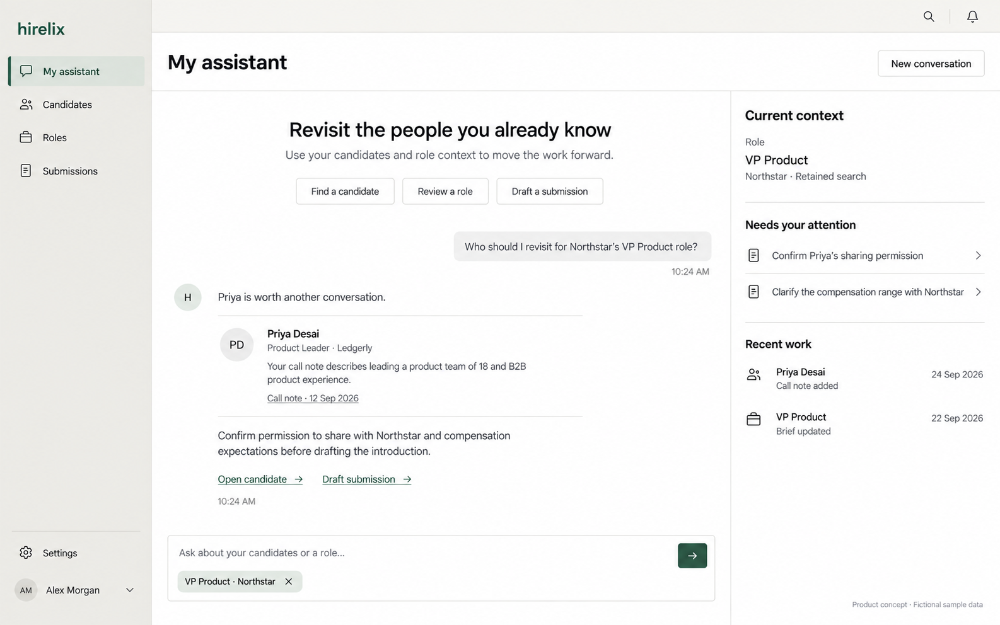
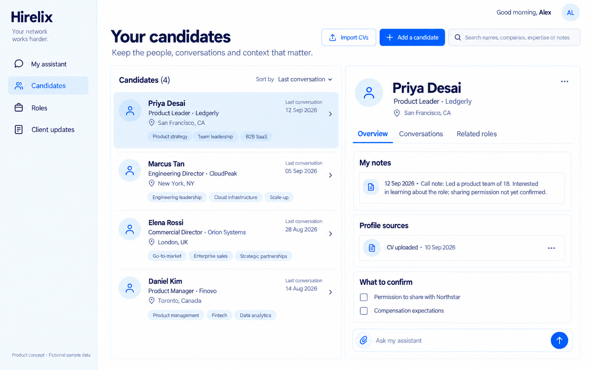
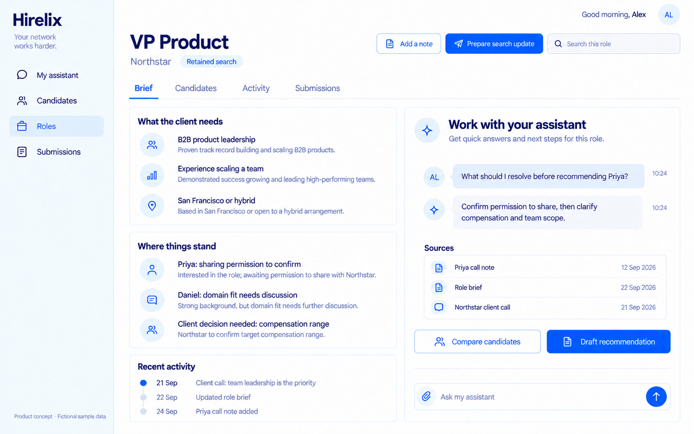
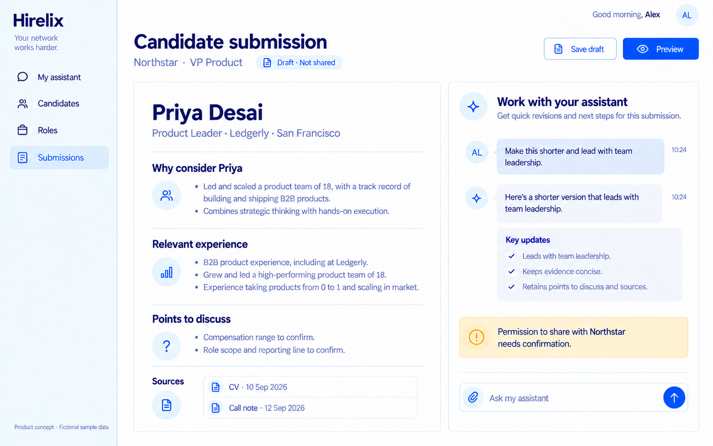
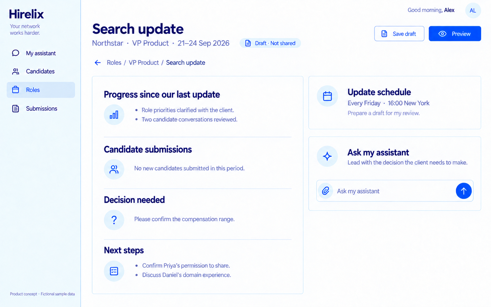
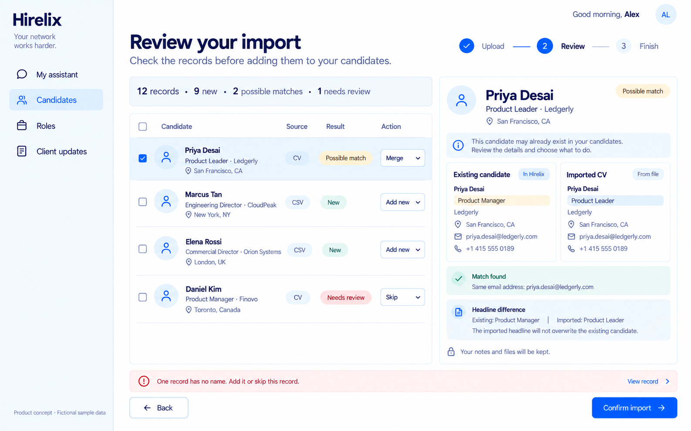

# Hirelix 产品说明书

## 专业猎头的私人 Agent

版本：1.4 ｜ 日期：2026-09-25 ｜ 文档性质：产品方向与目标体验规格

对外英文表达：**Your private AI assistant. Built for headhunters.**

本文面向产品、设计和开发协作。页面采用英文，服务海外专业猎头；说明采用中文。页面示意图均为 AI 生成的产品概念图，人物、公司、记录、数字和情境均为虚构。图中功能不代表当前版本已经具备。详细事实规则、字段含义与验收要求以本文为准。

本版本承接已经确认的三个方向：长期沉淀候选人、围绕 JD 持续推进工作、向甲方交付候选人推荐与定期搜寻进展。产品定位固定为专业猎头的私人 Agent。主导航使用 My assistant、Candidates、Roles、Submissions；职位进展汇报在对应 Role 内准备与查阅。

## 01. 产品决定与价值主张

Hirelix 为一名专业猎头持续工作：理解他积累的候选人资料、客户要求和沟通记录，帮助他重新找到值得考虑的人、理解每个职位的当前情况，并准备交给客户的材料。

猎头向 Hirelix 交付的不是一张需要每天维护的状态表，而是已有的工作材料和新的工作事实，例如简历、客户发来的 JD、一次通话笔记、一封反馈邮件。Agent 将这些材料联系起来，提出具体判断，完成可审阅的成果，并把后续反馈用于下一次工作。

产品价值由三个相互支撑的能力构成：

| 核心能力 | 猎头得到的价值 | 应形成的结果 |
| --- | --- | --- |
| 长期候选人管理 | 认识过、评估过的人不会因一次职位结束而丢失；过去的关系与观察可再次使用 | 可以检索、更新、追溯、导出的个人候选人库 |
| 围绕 JD 的持续工作 | 再次进入一个职位时，能立即知道要求、进展、卡点和该处理的问题 | 一个持续更新的职位工作上下文 |
| 面向客户的交付 | 提交候选人和同步进展时，材料准确、有依据、适合客户阅读 | 候选人推荐稿、搜寻进展更新及相关沟通草稿 |

产品承诺是“让猎头已有的积累在每个新职位中继续发挥作用，并减少重复整理和撰写”。不承诺保证成交、保证候选人愿意跳槽、穷尽外部人才市场或自动代替猎头建立信任。

## 02. 目标用户与选择依据

首批目标用户是面向海外市场、在一个或少数行业或职能领域持续经营的独立猎头与精品猎头公司的顾问。产品以顾问个人为主要使用者，先满足个人资料、职位和客户交付需求。

| 用户特征 | 为什么适合 | 第一版需要解决什么 |
| --- | --- | --- |
| 长期经营细分领域 | 不同职位会重复用到过去接触的人和行业认识 | 跨职位找回候选人与历史观察 |
| 同时推进多个客户职位 | 工作被多轮沟通打断，容易遗忘约定和上下文 | 随时恢复某个职位的真实进展 |
| 对客户交付负责 | 推荐理由、信息完整性和反馈质量影响专业信任 | 准备可直接审阅、修改的推荐与更新 |
| 资料分散在文件和日常通信中 | 反复手工搬运会使候选人库逐渐失效 | 低摩擦导入与持续补充 |

优先服务独家或预付费委托、重视持续客户沟通的专业顾问；按成功付费的顾问同样可以使用候选人与职位能力，但不强制设置定期客户更新。这个优先顺序是产品选择，不是已经证实的市场占有率或付费结论。

第一版不以企业内部招聘团队、派遣排班公司、覆盖整家机构的管理系统为主要对象。小团队共享、管理者统计和多级审批可在个人价值稳定后再考虑。

## 03. 调研依据与产品推论

本书采用六个已经核对的来源作为沟通习惯与推荐交付形式的依据，访问日期均为 2026-09-24。

| 来源 | 可以支持的事实 | 证据边界 |
| --- | --- | --- |
| AESC《选择高管寻访机构指南》 | 职位需求对齐、候选人评估和客户呈现是不同环节；候选人报告围绕具体职位提供材料和判断 | 协会视角偏向专业高管寻访，不能覆盖所有海外招聘业务 |
| Beacon Hill 顾问实践文章 | 顾问可以通过邮件介绍候选人，必要时电话解释，并需要具体客户反馈 | 招聘机构的一线经验，不是代表性抽样调查 |
| RecruiterU 关于独家与预付费客户的回答 | 从业者描述过按周发送进度报告并配合沟通的做法 | 个人经验与培训建议，不能当成全行业强制规范 |
| Bullhorn 客户提交操作文档 | 按职位向客户提交候选人，选择材料并记录提交 | 软件操作能力，不代表全部顾问的固定习惯 |
| Crelate 推荐邮件操作文档 | 一封邮件可推荐一人或多人，逐人附 CV，支持预览和内部备注隔离 | 软件操作能力，不代表每次推荐的合适人数 |
| Recruit CRM 客户提交操作文档 | 可用附件邮件、在线人选列表或高管寻访报告交付，并逐人收集反馈 | 软件操作能力，不代表邮件是唯一渠道 |

来源链接见文末。上述来源共同支持“候选人推荐”和“搜寻进展更新”应分开设计。本文进一步作出产品决定：候选人准备好时可随时制作推荐；搜寻进展按客户约定的周期或由猎头即时发起。周期到达不构成必须推荐新候选人的理由。

“定期给甲方候选人推荐”在本产品中具体落成两种交付。Candidate submission 面向某个人或一组选定的人；Search update 面向某个职位在某段时间内的工作进展。两者共用候选人和职位上下文，保留各自不同的结构与触发方式。

## 04. 定位、命名与语言规范

产品应在一句话中说明“服务谁”和“替他处理什么”。对外介绍与注册前页面使用以下文案；登录后的工作页面优先展示当前工作，后续宣传需与能力边界一致。

**主标题：Your private AI assistant.**

**定位说明：Built for headhunters.**

**补充说明：Keep your candidates, stay on top of your roles, and prepare client-ready work.**

其中 client-ready 表达材料的目标质量；具体生成结果仍清楚显示 Draft，经过猎头审阅后再用于外部沟通。

| 场景 | 使用的词 | 使用方式 |
| --- | --- | --- |
| 产品总体定位 | 专业猎头的私人 Agent | 中文产品和团队说明 |
| 面向海外用户的身份 | Private AI assistant for headhunters | 解释产品服务于顾问个人 |
| 首页导航 | My assistant | 提问、补充材料、恢复工作、发起任务 |
| 长期候选人库 | Candidates / Your candidates | 包含已认识的人和主动保存的潜在人选 |
| 职位工作 | Roles | JD、客户需求、候选人、活动与客户材料 |
| 候选人推荐主栏目 | Submissions | 推荐草稿、已提交人选与客户反馈的统一入口 |
| 单人或多人推荐编辑页 | Candidate submission | 始终关联具体客户和职位 |
| 职位内的进展汇报 | Search update | 在对应 Role 内生成，明确报告期间与待客户决定的事项 |
| 客户需求说明 | Role brief | 原始 JD 与经过对齐的工作要求 |

不把 Recruiting agent 用作本产品类别；不把 Talent memory、人才记忆、长期上下文等系统内部概念作为栏目名称。避免全局“好候选人”、无证据的“已验证”、未确认的“随时可入职”，以及把工具调用数量包装成业务进展。

主栏目 Submissions 表达“把候选人推荐给客户”这项工作；首次进入的页面标题使用 Candidate submissions，说明文字为 “Prepare candidate submissions and track client feedback.”。Search update 从职位页的 Prepare search update 发起，历史保留在该职位的 Activity 中。

界面支持中文与英文，用户可在 Settings 中切换；选择保存到个人账户，刷新及再次登录后继续生效。导航、按钮、表单、状态和帮助文案随界面语言切换。已保存的 JD、候选人资料、通话记录和原始文件保留原文，不因界面切换而改写。

Candidate submission 与 Search update 的草稿语言在准备时单独选择，默认使用当前界面语言，可在单份草稿中覆盖；选择写入任务和来源快照，后续修订默认保持原语言，除非用户明确要求翻译。跨语言整理应保留职位名称、公司名、货币和日期，不随意翻译成不同含义。六张概念图展示英文界面状态，中文模式遵循同一页面结构。

## 05. 一条完整的使用过程

以下为目标体验示例，人物与数据均为虚构。

1. Alex 导入已有候选人 CSV 和若干份 CV。Hirelix 先预览字段映射、重复记录和无法识别的文件，Alex 确认后入库。
2. Northstar 发来 VP Product 的 JD。Alex 新建 Role，补充客户通话记录：团队建设是首要任务，地点可接受混合办公，薪酬尚未确认。
3. Alex 问“以前接触过的人里，谁值得重新聊一下？”Agent 检索候选人库，结合具体职位返回理由、来源和缺口。
4. Alex 与 Priya 通话后记录实际内容。Agent 将团队管理经历补入候选人资料，同时记录她对 Northstar 这个职位的态度；没有把这次态度扩展成她对所有机会的兴趣。
5. Alex 要求“写一份给 Northstar 的推荐稿”。Agent 生成依据职位组织的材料，保存到 Submissions 并关联这个职位。Alex 决定修改、补充、导出或稍后再用。
6. 到客户约定的更新日，Agent 在该 Role 内准备 Search update。若没有正式提交新候选人，直接说明，同时列出需要客户确认的薪酬和下一步。
7. 客户反馈更看重团队建设而非行业完全匹配。Alex 保存反馈；职位要求出现新版本，相关人选判断可以重新检查，既有报告保留当时依据。
8. 职位结束后，资料与关系记录仍然存在。下一份 JD 可以再次使用这些信息，不需要重新创建同一个人。

## 06. 产品结构与主要入口

产品设四个主要入口。Settings 作为辅助入口容纳账户、资料导入导出、连接、通知与账单。新增的业务对象只有必要的客户联系信息，不额外建立完整客户销售 CRM。

| 入口 | 首要问题 | 核心操作 | 页面结果 |
| --- | --- | --- | --- |
| My assistant | 今天或此刻需要帮我处理什么？ | 提问、附加材料、选择候选人或职位上下文 | 回答、可审阅变更、工作草稿 |
| Candidates | 我有哪些人？对他知道什么？ | 搜索、导入、补充、合并、查看历史 | 可持续积累的候选人档案 |
| Roles | 这个职位目前是什么情况？ | 保存 JD、记录反馈、比较人选、准备进展汇报 | 职位详情、下一步与汇报历史 |
| Submissions | 向哪位客户推荐了谁？反馈如何？ | 准备推荐、编辑、预览、导出、记录提交与反馈 | 推荐草稿、已提交人选与反馈 |

My assistant 是横跨以上内容的工作入口。Candidates、Roles 和 Submissions 提供可直接访问的档案、职位和推荐记录。Search update 归属对应 Role；从对话生成后也能回到职位找到原稿。每个详情页都能对当前对象继续发问。

## 07. 页面一：My assistant

**页面目的。** 让猎头用一句话开始或恢复工作。视觉主角是当前问题与结果，而非大量运营数字。

**布局。** 左侧为紧凑导航；中间是对话正文与可打开的成果；工作区上下文按需展开。新对话基于已有职位或待确认资料，给出一句有事实依据的主动开场和一个可继续发送的具体建议；不摆放固定任务菜单。助理回答按正文排版，引用就近展示；输入框固定在工作区底部。

**主要交互。** 用户可以明确选择 Role、Candidate，也可以自然提及姓名或客户名。助理先完成眼前请求，再根据已知职位、候选人和材料提出一个有依据的下一步；缺少关键事实时只问一个能推动工作的具体问题。用户只说“你好”或笼统询问下一步时，助理应接续真实的进行中工作，而非重新自我介绍或反问“需要我做什么”。存在重名或多个同名职位时，Agent 先澄清对象。材料先作为对话上下文阅读；只在内容和用户意图支持时提出入库或对象变更，并由猎头确认。

候选人对某个职位的资料分享授权属于职位与候选人的关系事实。猎头报告同意或拒绝时，助理应准备一项可审阅变更：留下只涉及该候选人的依据记录，并同步更新该职位的授权状态；两者在确认后同时保存。回复和界面必须清楚说明确认前尚未保存，也不能把“准备推荐稿”解释成已向客户发送。

助理说“已准备”某项变更时，对话里必须同时提供对应的审阅入口；无法明确对应候选人或职位时，应直接说明缺少什么事实。对用户展示姓名和职位名称，不展示内部对象编号或状态枚举。

**对话内材料处理。** 猎头在主对话直接附上 JD、简历、名单、客户消息或其他材料，也可以将文件拖到输入区。文件先进入当前对话，助理结合文字指令理解其用途；普通文件可以直接讨论，JD 不会自动变成候选人。候选人导入草稿、去重与保存确认仍留在对话中；只有猎头确认后才进入长期候选人库。Candidates 页面承担查阅与管理，导入入口回到私人助理。

回答中出现的候选人可直接打开档案；提到的证据可定位原文或笔记；生成的推荐稿可打开独立编辑页。对话内容不能仅以自由文本存在而使后续无法访问成果。

**状态要求。** 没有已有资料时，用自然的开场邀请用户带来当前工作材料；有真实上下文时主动接续一件具体工作。没有足够资料时说明缺什么；生成中显示正在读取哪类资料；失败后保留原问题和附件，提供重试；恢复页面时保留已完成结果，不能把仍在运行的任务表现为消失。

**验收。** 用户从一句“帮我准备 Northstar 的更新”进入正确职位并得到有时间范围的草稿；同时有两个 Northstar 职位时先澄清；引用来源与结论能够相互核对。

## 08. 页面二：Candidates

**页面目的。** 保存猎头在工作中积累的人、资料和观察，并在未来能找回和使用。

**档案结构。** 身份与联系方式、职业经历、地点与工作方式、来源文件、个人笔记、沟通记录、关联职位。动态信息如当前角色、求职态度、薪酬预期，应保留记录时间和来源。页面可以展示“最近沟通”，不把“最近导入”混为同一时间。

**检索体验。** 支持姓名和精确字段查找，也支持自然语言描述，例如“去年聊过、做过 B2B 平台、曾带过产品团队的人”。返回结果应说明为什么被找出，允许打开原始笔记。姓名查找与语义召回不是同一种质量保证，界面不能笼统宣称“搜遍全部且没有合适的人”。

**记录与更新。** 手动笔记以原文保留，Agent 可以建议提取字段。用户接受修改后，旧值与来源仍可追溯。不同资料发生冲突时并列展示，不能无声覆盖。合并两个档案时保留所有来源；名称相同不足以自动合并。

**作用边界。** 一个候选人只有一份个人档案，可以关联多个职位；适配判断和客户反馈属于具体职位。对职位 A 的拒绝不能变成这个人的全局负面标签。

**验收。** 同一个人的两份 CV 合并后历史笔记不丢失；职位删除不连带删除个人档案；修正职位经历后，旧报告仍能显示生成时使用的资料版本。

## 09. 页面三：Roles

**页面目的。** 在任何一次进入时，立即说明这个职位的工作目标、当前事实、阻碍和下一步。

新建职位可以从粘贴 JD 或导入文件开始，不要求先运行外部 sourcing。最低输入是职位标题、客户名称和 JD；可逐步补充联系人、合作方式、地区、薪酬、交付约定与时区。

| 详情区域 | 应展示什么 | 用户能做什么 |
| --- | --- | --- |
| Brief | 原始 JD、确认后的重点、可放宽条件、未知信息及版本 | 接受建议、补充客户反馈、对比版本 |
| Candidates | 本职位相关的人、关联理由、证据缺口、已记录的互动 | 比较、重新判断、打开档案、准备推荐 |
| Activity | 通话、反馈、资料变更、进展汇报草稿与交付记录 | 添加记录、查来源、按 Search updates 筛选汇报历史 |
| Submissions | 本职位的推荐草稿、已提交人选与客户反馈 | 编辑、预览、导出、记录提交与反馈 |

职位页提供 Prepare search update 按钮，直接打开带有本职位上下文的进展汇报编辑页。该页侧栏选中 Roles；返回路径为 Roles / 职位 / Search update。草稿在 Activity 中明确显示 Draft，不计为已交付事件。

“工作进度”是对真实工作事实的概括。例如“等待客户确认薪酬”“Priya 尚需确认分享意愿”。生成一段文字不等于完成了联系，保存一份草稿不等于推荐已提交。

Agent 可从材料中提出下一步建议；猎头仍能直接编辑和标记事实。无需为了出现进度而强迫用户维护固定招聘漏斗。确实发生的面试或 offer 事件可以记录，但第一版不承担企业 ATS 的流程审批。

**验收。** 新客户反馈使要求发生变化时，只重新检查本职位相关判断；没有新证据时不得自动推进候选人；暂停的职位不再持续准备周期草稿；结束职位仍可查历史。

## 10. 页面四：Candidate submission

**页面目的。** 将猎头选定的一位或多位候选人针对同一职位的推荐材料组织成一次提交，供猎头审阅和使用。人数由猎头决定，不预设为固定三个；每位候选人保留独立的推荐理由、附件选择和后续反馈。

**入口与列表。** 主导航 Submissions 打开 Candidate submissions 列表，按客户、职位或候选人查找，可查看 Drafts 与 Submitted。记录展示人选、客户、职位、实际提交时间和已记录反馈；编辑页与职位内 Submissions 使用同一份记录。空列表提供 Prepare candidate submission，并解释需选择职位和人选。

**输入。** 已选 Role、一位或多位已选 Candidate、为每人明确选定的 CV 版本、有关笔记、推荐时点、客户阅读偏好和猎头补充说明。未选择职位时可以先写个人简介，但不能叫“对该职位的推荐判断”。

**默认结构。** 邮件主题和简短开头；逐人列出身份与当前情况、为什么值得考虑、对应职位的具体经历与证据、待核实的点及已经确认的意愿和条件；逐人标明选定附件；最后说明希望客户如何分别反馈和下一步。缺乏依据的形容词不能代替经历。

**推荐包与交付形式（2026-09-24 核对）。** 面向普通招聘委托，默认准备可直接复制到邮件的主题与简短正文。一次可以推荐一人或多人；多人时在同一封邮件中逐人说明与职位匹配的具体经历、推荐理由、已确认的条件和待核实的问题，并为每人明确选择一版 CV，邀请客户逐人反馈。不得把多人压成一个笼统的匹配结论。原始 CV 可以是 PDF 或 DOCX；如果猎头选择经过整理、匿名化或转成 PDF 的版本，必须先预览成品，不把格式转换视为候选人已同意分享。某人没有可用 CV 时显示该人的缺口，允许先保留草稿。面向高管寻访或客户明确需要时，可进一步导出候选人短名单及各人的独立报告，并与各自所选 CV 一同交付。邮件、报告、客户系统资料和电话讲解是同一次推荐的不同呈现方式；本产品以 Role、Candidate、一次实际提交及逐人反馈记录连接它们，不把“生成邮件”记为已经推荐。不同客户可能要求不同收件材料，最终范围由猎头逐项确认。

**编辑方式。** 用户可直接改正文，也可要求 Agent 缩短、调整顺序、改语气或补充某个有来源的点。改稿应保留原版本并说明重要事实是否改变。改成“更积极”不能把未知意向改成“积极寻求新机会”。

**内外区别。** 内部资料可包含猎头私下观察；外部材料只包括用户选择分享的内容。预览页必须让用户看到客户将看到的准确文本与附件。原始私人笔记不会因为被模型引用过就默认附给客户。

**交付。** 首先提供复制和 PDF/DOCX 导出；导出不等于已经发送。未来邮件连接可增加发送能力，但需要用户明确选定收件人、内容和附件。候选人的分享范围未确认时，保留草稿，并把未确认点呈现给猎头；不得生成“已取得同意”的句子。

## 11. 页面五：Search update

**页面目的。** 在 Roles 内，根据一个职位的实际工作记录，准备一段时间内给客户的进展说明。时间范围应明确，并与上一次真实交付的内容衔接。主导航选中 Roles，页面提供返回该职位的路径。

**触发。** 用户随时要求生成；或为这个职位设定每周、每两周、某个工作日的草稿准备时间。周期以职位为单位，可暂停；客户不需要周期汇报时不用设置。

| 内容区域 | 默认内容 | 没有信息时的处理 |
| --- | --- | --- |
| Progress since last update | 实际新进展、需求变化和已完成的重要工作 | 说明没有新增可确认进展，不编造忙碌 |
| Candidate submissions | 本期实际提交的人选及已记录反馈 | 说明本期未提交新人选 |
| Market feedback | 来源明确的候选人或客户反馈 | 不把一两次沟通说成总体市场统计 |
| Decisions needed | 需要客户给出答案的问题及其影响 | 没有则省略 |
| Next steps | 已约定或建议的下一步，区分两者 | 不声称尚未安排的会议已排期 |

自动准备的只是草稿。页面显示草稿依据的时间区间、主要来源、与上一版区别及缺失记录。猎头可编辑、删除段落、预览和导出。

**无记录不等于无工作。** 如果系统只收到部分材料，应表述“基于已记录的信息”，并提醒补充未记录的工作；不得对猎头的实际工作量做无依据结论。

**验收。** 一周没有新人选时仍可给出真实且有用的更新；同一条客户反馈不重复当成本周新进展；跨时区和夏令时按所选时区执行；生成任务重试不会产生多份同周期草稿。

## 12. 页面六：Import review

**页面目的。** 让用户已有的积累进入产品，保持来源、身份和上下文。导入体验直接决定候选人库是否能长期使用。

**入口调整。** 此图表达导入确认所需的信息；当前交互以主对话中的结果卡片和按需展开的确认视图承载。正常导入、冲突确认和继续交流在原对话完成，独立页面仅保留旧导入记录的恢复入口。

第一版支持 CSV 与文本型 PDF/DOCX CV，支持粘贴笔记和链接。扫描件识别可作为后续能力；不支持的文件应明确说明并允许取回，不显示解析成功。链接仅保存或在具备访问能力时读取公开内容，不暗示已经同步某个平台全部私有资料。

导入过程包括：选择文件、识别字段、查看样本、提示疑似重复、确认新增与合并、显示逐项结果。能确定的格式问题用代码校验，自然语言经历和职位描述由模型结构化；模型不确定的字段保留原文并标记。

用户可决定导入为新档案、合并到已存在的人、跳过。取消操作不会留下半份不可识别的档案。批量导入有稳定任务记录，刷新后可恢复；失败项目可重试，成功项目不重复创建。

**验收。** 中英文混合 CV 不丢原文；一个人的多份文件可并存；疑似重复支持人确认；没有日期的笔记不自动填成今天发生；大量候选人导入后检索范围能正确说明。

## 13. 三项核心能力的需求清单

下列编号用于产品和开发协作，不需要出现在用户界面。

| 编号 | 需求 | 优先级 | 完成标准 |
| --- | --- | --- | --- |
| C01 | 手动新增与编辑候选人 | 首个可用版本 | 必要身份信息、来源和笔记可保存、再打开 |
| C02 | CSV/CV 导入、去重与合并 | 首个可用版本 | 支持预览、逐项结果、冲突处理、重试 |
| C03 | 候选人来源与沟通历史 | 首个可用版本 | 原文和记录时间可追溯，不用覆盖代替历史 |
| C04 | 全库检索与 JD 下的人选找回 | 首个可用版本 | 旧记录仍可召回，展示依据与检索范围 |
| C05 | 导出与删除 | 首个可用版本 | 用户能带走档案及资料，删除结果可验证 |
| R01 | 独立新建 Role 与保存 JD | 首个可用版本 | 不依赖 paid sourcing 作业才能保存职位 |
| R02 | 客户要求对齐与版本 | 首个可用版本 | 区分原文、已确认要求与建议 |
| R03 | 候选人与职位关联 | 首个可用版本 | 同一人多个职位判断彼此独立 |
| R04 | 记录事实、反馈和卡点 | 首个可用版本 | 进展可追溯到实际记录与事件 |
| R05 | 暂停、结束与恢复职位 | 首个可用版本 | 保留历史并控制周期草稿 |
| O01 | 单人/多人的推荐草稿 | 首个可用版本 | Submissions 汇总草稿、提交记录与反馈，不自动凑人数 |
| O02 | 按时间范围的搜寻进展草稿 | 首个可用版本 | 从 Role 发起并保留历史，基于记录说明变化与下一步 |
| O03 | 编辑、版本、预览、复制与导出 | 首个可用版本 | 导出与预览一致，支持回看旧版本 |
| O04 | 定期准备进展草稿 | 首个可用版本 | 明确时区，可暂停，重复执行不重复产出 |
| O05 | 邮件发送与回复同步 | 后续版本 | 明确收件人、附件、授权和可核对的发送结果 |

“首个可用版本”指本方向可以开始正式面向目标用户提供完整价值的目标范围；不是当前仓库所有项目已经完成的声明。

## 14. Agent 应如何工作

Agent 的基本过程是理解用户要完成的事、识别相关人和职位、读取必要证据、执行可支持的操作、生成成果并保留与来源的关联。

| 用户输入 | Agent 应采取的动作 | 合格结果 |
| --- | --- | --- |
| “把这次通话记到 Priya 名下” | 识别人、保留笔记原文、提取建议字段，歧义时询问 | 可打开的通话记录与相关更新 |
| “这个 JD 我以前有合适的人吗？” | 检索整个可访问候选人库，再结合 JD 审阅证据 | 候选人、理由、缺口、来源与范围说明 |
| “这个职位现在卡在哪？” | 读取本职位事件、要求和最近反馈 | 事实、待决定项和建议分别明确 |
| “给客户写 Priya 的推荐” | 读取所选职位与候选人资料，检查外部材料范围 | 可修改的职位相关推荐草稿 |
| “周五准备一份更新” | 在产品内保存该职位的草稿准备约定 | 明确时区、时间范围和暂停方式 |
| “客户说行业经验可以放宽” | 保存原始反馈，提出本职位要求修改并重新检查关联判断 | 新版本及受影响内容，保留旧版本 |

Agent 的回答不是已经发生的工作事实。只有真实来源或用户明确记录的动作才能更新“联系过、推荐过、面试过”等信息。它可以准备一封邮件，不得仅因准备完成就写入已发送。

自然语言请求中的身份、日期或对象不清楚时，询问最少的关键问题。无阻塞信息时先完成可完成的部分，例如先起草主体并明确缺少薪酬；不要用长表单作为所有任务的前置条件。

## 15. 数据对象与关系

长期价值依赖正确的数据关系。以下是逻辑模型，不要求以相同数量新增数据库表。

| 对象 | 主要内容 | 关系与归属 |
| --- | --- | --- |
| Candidate | 身份、职业资料、联系方式、个人笔记 | 属于用户；跨多个 Role 持续存在 |
| Source / Record | CV、来源链接、通话笔记、客户邮件摘录等原始材料 | 可关联人、职位或客户，保留来源与时间 |
| Role | 原始 JD、要求版本、客户联系信息、工作约定 | 属于用户；独立于外部搜寻作业 |
| Candidate-Role context | 适配依据、关注点、意向与互动情况 | 只对该人和该职位成立 |
| Activity | 实际事件、时间、来源、记录者 | 可形成职位进度和报告期间的事实依据 |
| Client deliverable | 推荐或进展更新、内容、版本、输出范围 | 关联 Role，可关联多个 Candidate |

个人档案是可修改的当前视图；原始记录提供历史依据；职位相关判断跟随职位要求版本；客户材料保留生成和最终审阅时的内容快照。三种时间应区分：事情发生的时间、材料进入系统的时间、最近修改时间。

例如，2026 年导入的一份 2024 年通话记录不能写成“本周与候选人沟通过”。一份旧 CV 的导入日期也不能证明候选人仍在其中列出的公司任职。

## 16. 检索、证据与长期积累

产品必须能使用长期候选人库中的旧记录。只读取最近若干条档案是当前实现限制，不能作为长期方案或对外能力承诺。

目标过程为：在用户权限范围内检索相关人和资料；优先找出与问题及 JD 有关的证据；由模型比较具体要求；返回来源与缺口。结构检索和语义检索用于找到材料，不能用职位关键词碰撞替代最终判断。

每条重要结论至少能追溯到候选人档案或原始记录。来源不足时返回“未知/需要确认”；资料冲突时说明不同来源与日期；检索未完成或只覆盖部分材料时明确范围。

用户修正 Agent 后，应修改对应事实或本职位的判断依据，不把一次否定变成跨全部职位的规则。客户反馈同样要限定范围，例如“Northstar 当前团队不需要纯增长背景”，不能推断“增长候选人不值得保留”。

原始材料视为待解释的数据，其中出现的命令不能改变产品权限、泄露其他资料或代替用户授权。跨账号隔离必须在读取数据时实现，不能只依赖提示词。

## 17. 客户交付的两个英文样例

以下文本为说明输出结构而写的虚构样例。真实产品必须根据实际材料生成，不能把样例人选、数字、意向或许可写入用户数据。

### 样例 A：Candidate submission

Subject: Priya Desai - VP Product, Northstar

Hi Morgan,

I would like to introduce Priya Desai for the VP Product role. She has confirmed that she is happy for me to share her profile with Northstar.

Why I think a conversation is worthwhile:

- She led a product team of 18 at Ledgerly, which is relevant to the team-building priority we discussed.
- Her CV and our screening conversation describe direct responsibility for a B2B product portfolio.

Points to explore in the first conversation:

- The scale of ownership Northstar needs compared with her previous remit.
- Compensation alignment. I have not confirmed her expectations yet.

I have attached the CV she approved for this introduction. Would you like me to arrange an initial conversation?

Best,
Alex

这个样例对应“猎头已补充并确认可以向 Northstar 分享”的后续情境。图 4 则展示补充之前的草稿状态。许可、CV 附件和团队人数都必须能在真实资料中找到依据；正文不能默认加入该样例中的确认句。

### 样例 B：Search update

Subject: VP Product search - update for 21-24 September

Hi Morgan,

The main decision needed this week is confirmation of the compensation range. This will help me qualify the next conversations consistently.

Since our last update, we clarified that team leadership is the primary requirement and reviewed two candidate conversations. No new candidates were submitted during this period.

Next, I will confirm whether Priya is happy for her profile to be shared and clarify Daniel's relevant domain experience. Please let me know whether the proposed compensation range is approved or needs revision.

Best,
Alex

这个样例的价值是把需要客户决定的事项放在前面，并诚实说明推荐情况。它不通过虚构名单或搜寻数量来制造进展。两份样例对应不同时间点，不可自动混用。

## 18. 导入、集成与日常使用负担

候选人库能否积累，取决于用户是否需要反复整理。优先让已有材料自然进入产品，并使导入后的资料立即能用于某个实际问题。

| 阶段 | 输入方式 | 产品要求 |
| --- | --- | --- |
| 首个可用版本 | CSV、PDF/DOCX CV、粘贴文本、保存链接 | 预览、来源、去重、逐项错误与可恢复任务 |
| 后续优先 | Google/Microsoft 邮件中的用户指定线程与附件 | 按选定范围关联，避免无差别读取整个邮箱 |
| 后续按需求 | 日历和会议记录 | 会议存在不等于会议已发生；录音或笔记需要来源和权限 |
| 后续按需求 | 已有 ATS/CRM 的导入或连接 | 先定义资料归属、冲突处理、删除与同步方向 |
| 辅助能力 | 公开资料研究和现有 sourcing | 由猎头按需使用，标明来源和时间 |

产品无需要求用户把所有客户与候选人的沟通搬进新聊天系统。用户仍可通过自己的邮件和电话工作；Hirelix 先提供轻量记录、资料关联、材料准备和成果导出。

## 19. 私人数据、分享与可靠性

“私人”要落实成用户可理解的行为：个人候选人库默认只对本人可见；向客户导出的内容有明确范围；用户能取回自己的资料；删除与解除连接有确定结果。

客户材料中的私人备注、联系方式和附件由猎头选择。产品不把未选择的内部观察附带给客户。未来若有公开分享链接，需提供访问范围、撤销、失效时间和明确预览；第一版可以先用导出避免引入客户账户系统。

对外操作要区分草稿、已导出、已发送与已收到反馈。“已发送”只由确实的发送结果或用户明确记录支持；“客户看过”需要实际证据，不能由打开预览推断。

运行可靠性包括：用户输入自动保存；长任务可以恢复；重试不重复写入；失败不展示为空成功；来源不可访问时保留已有快照并说明；新结果不会无声覆盖正在编辑的内容。

这些是产品行为要求，不构成某一国家或地区的法律合规结论。正式推出前需根据销售地区、数据来源和连接范围完成对应审查。

## 20. 通知与定期准备

提醒围绕用户已经设置的约定和有明确影响的变化。默认通知包括需要用户确认的导入冲突、生成失败、已约定时间准备好的客户草稿；不为每次检索、保存或小改动发送提醒。

用户为 Role 设置更新约定时，保存频率、当地时间、时区、报告范围和暂停状态。系统离线、任务失败或资料不足时，说明真实情况，保留再次处理的入口。

无新增记录时仍可准备简短更新，但不反复推送“没有变化”。如果用户选择仅在有变化时提醒，应遵守该选择。定时运行完成意味着草稿已准备，不能被界面翻译成“客户已收到周报”。

## 21. 视觉、响应式与可访问性

**视觉方向。** 页面采用暖白底、炭黑文字与少量深绿强调。工作内容占据主要空间，资料通过字号、字重、对齐和细分隔线形成层级。控制彩色区域面积，减少嵌套卡片、重复边框和装饰图标。事实、来源、缺口与操作应有稳定位置。

| 元素 | 实现基准 | 使用范围 |
| --- | --- | --- |
| 页面 / 工作面 | #F6F5F1 / #FFFFFF | 暖白环境与白色资料区 |
| 导航 / 分隔线 | #EEEDE8 / #DEDED6 | 浅石色侧栏与细边界 |
| 正文 / 次要文字 | #242824 / #687068 | 人名、正文、日期与来源 |
| 主操作 / 选中底色 | #2D5546 / #E2EAE2 | 少量深绿按钮与浅绿选中态 |
| 字体层级 | 无衬线；标题 24–28px，正文 14–16px | 常规与中等字重；文稿标题可用衬线体 |
| 控件与间距 | 图标 16px；常规圆角 6px；间距 8px 倍数 | 紧凑导航、表格与编辑工具条 |

桌面导航约 206px 宽，候选人用紧凑列表与右侧档案组成连续工作面，选中行仅用浅底色和细侧线。姓名缩写足以标识人选；照片不决定排序或评价。首页回答按清楚的正文组织，右栏只保留相关上下文。推荐稿与汇报采用纸面阅读布局，助理工具置于窄侧栏。

桌面上候选人列表与档案可左右展示；移动端先列表后详情，不把两个窄栏硬塞进同一屏。职位页在移动端将上下文与助理结果顺序展示。长报告支持持续滚动，编辑器保留未保存提醒。

常见操作要有键盘可达、可见焦点和清楚标签，颜色不能成为唯一状态提示。指定配色中，正文与暖白底对比度约 13.71:1，次要文字约 4.69:1；需在实现后的各实际状态继续核对。待确认用简短文字与小型琥珀色标记表达。来源可展开查看原文，默认回答保持易读。

导出文件需保留标题、段落、列表和链接；PDF 不出现裁切、乱码、半个表格和空白占页。复制到常用邮件编辑器后仍可阅读，不依赖产品专用组件。

## 22. 当前实现与目标体验的差距

本次文档制作时核对了本地代码基线 eea54c0。以下描述代码范围；不据此推断生产已经上线。前一轮本地链路验收记录可供参考，部署状态需要另行核查。

| 能力 | 当前本地基线 | 本书目标所需补充 |
| --- | --- | --- |
| 候选人 | 手动保存、从已有搜索保存、编辑一段笔记 | 导入、去重合并、资料版本、沟通记录、完整检索 |
| JD 上下文 | 使用已有搜索记录中的 JD | 独立 Role，支持客户要求版本、反馈与真实进展 |
| 对话 | 按用户保存，可指定 JD | 稳定对象关联、来源定位、可恢复任务和成果入口 |
| 候选人检索 | 最新最多 120 条并受文本预算限制 | 面向整个候选人库的召回，长期旧资料同样可找回 |
| 客户材料 | 固定 weekly brief 草稿与修改 | Candidate submission / Search update 两类成果 |
| 定期准备 | 尚无定时生成 | 每职位约定、时区、暂停、去重与失败恢复 |
| 外部输入输出 | 暂无邮件或日历连接 | 文件导入和成果导出先完成，连接按范围补充 |
| 产品文案 | 仍有旧栏目命名 | My assistant / Candidates / Roles / Submissions；进展汇报在 Role 内 |

本产品说明书和示意图是本次交付范围；它们不等于以上补充功能已经被实现。本次不修改应用业务代码，也不执行生产迁移或部署。

## 23. 实施顺序与范围边界

实施顺序按依赖关系推进，以能交付完整用户价值为目标，不通过先堆界面再补数据关系的方式推进。

| 阶段 | 需要完成的结果 | 进入下一阶段的依据 |
| --- | --- | --- |
| 一：产品语义与对象 | 统一命名；Role 独立于 sourcing；Candidate 与 Role 分开；定义原始记录和成果版本 | 用户能在不运行外部搜索的情况下建立真实工作上下文 |
| 二：已有资料进入产品 | 导入、来源、去重、历史、导出和全库检索 | 旧候选人可被新 JD 正确找回，身份和来源不丢失 |
| 三：围绕职位持续工作 | 需求版本、记录活动、反馈回流、卡点和相关候选人 | 更新来自真实事实，不要求重新填整套流程 |
| 四：完成客户交付 | 两类草稿、编辑、预览、导出、定期准备 | 猎头能用自己的资料产出有依据的客户材料 |
| 五：减少日常搬运 | 邮件等连接、移动端优化、必要的小团队共享 | 权限、来源、冲突和可靠性均清楚 |

不在首个范围内：全市场自动 sourcing、自动批量联系陌生人、企业级招聘审批与 HRIS、全公司销售 CRM、候选人自动全局评分、招聘成交保证、客户必须登录的协作门户。

现有 sourcing 可保留为补充能力，但候选人库、Role 和客户材料必须能在没有它的情况下独立工作。付费第三方数据使用需有明确用量与费用展示。

## 24. 验收场景与质量要求

| 场景 | 必须观察到的行为 | 不合格表现 |
| --- | --- | --- |
| 新用户无资料 | 能从导入候选人或添加 JD 开始；知道下一步 | 空白聊天，无方向，无数据却显示成功推荐 |
| 导入同一人多份 CV | 可解释的重复提示，合并保留笔记和文件 | 靠同名自动合并，资料覆盖丢失 |
| 大量候选人后问旧资料 | 相关旧人选能参与召回；说明范围 | 只查最近 120 人却声称全库无结果 |
| 同一人关联两个 JD | 判断和客户反馈独立，个人资料共用 | 一个岗位被拒绝后全部岗位自动排除 |
| JD 更新 | 原文与版本可回看，相关判断标明旧依据 | 旧报告内容被静默改写 |
| 记录过去的通话 | 发生时间与录入时间分开 | 今天导入就写入“本周已联系” |
| 推荐意向未明确 | 可形成草稿，未知信息清楚显示 | 自动声称愿意跳槽或已授权分享 |
| 本周没有新人选 | 更新说明真实进展和待客户决定项 | 为满足周报结构虚构三名推荐人 |
| 原始资料相互矛盾 | 展示冲突来源和时间，允许修正 | 挑一个值当事实且隐藏冲突 |
| 生成失败或刷新 | 输入、任务和已完成成果仍可恢复 | 空回答显示成功，重试重复写入 |
| 用户 A 访问用户 B | 读取和写入均被拒绝，无资料泄露 | 仅在页面隐藏而 API 可读取 |
| 外部预览与导出 | 收件材料范围准确，内部笔记不混入 | 导出内容与用户预览不一致 |
| 定期任务跨时区 | 按所选当地时间准备，暂停后停止 | 重复草稿、时区漂移或自动发送 |
| 移动端真实交互 | 列表、档案、草稿完整可读且可操作 | 横向溢出、按钮被遮挡、内容丢失 |
| 中英文切换 | 账户设置持久保存，主要页面及登录界面完整切换；草稿语言单独选择且生成、修订、预览一致 | 只切换少数菜单、刷新后回退、中文草稿混入英文模板或误改原始资料 |

验收需要真实浏览器观察与截图，覆盖空态、加载、成功、失败与恢复。涉及模型、数据库、导入、导出或定时准备的主链路，应使用实际依赖验证；静态截图、构建或单元测试分别只证明对应环节。

质量评价以事实准确、来源可追溯、上下文正确和用户可完成工作为主。简历判断需由熟悉职位的人复核，不能仅以模型自评分作为质量结论。

## 25. 成功指标与商业表达

北极星方向是“猎头在真实客户职位中持续使用自己的候选人积累，并完成客户交付”。指标用于判断是否兑现产品价值，不应代替产品方向。

| 指标 | 定义 | 解释边界 |
| --- | --- | --- |
| 有效激活 | 用户导入或保存个人候选人，创建真实 Role，并使用其资料完成首次任务 | 注册、点击或空对话不计为价值实现 |
| 候选人复用 | 既有候选人在新的 Role 中被找回并由猎头进一步查看或使用 | 不等于匹配正确或已经成交 |
| 职位持续使用 | 用户在后续日期回到同一 Role，补充记录并使用上下文 | 排除系统定时任务造成的虚假活跃 |
| 成果采用 | 草稿经用户审阅后被复制、导出或明确使用 | 不把生成次数当成发送或客户认可 |
| 事实更正 | 人名、日期、经历、意向、许可或客户要求被实质纠正的次数 | 与风格改稿分开衡量 |
| 重复整理耗时 | 用户完成同类资料整理与客户材料准备的实际时间 | 通过任务观察测量，不预先宣称节省比例 |

商业表达围绕个人持续价值、资料可积累和交付质量。候选订阅方式可以按顾问账户与明确用量边界设计；具体价格尚未决定。定价研究前不把竞品价格、市场规模、收入目标或付费意愿写成既定事实。

## 26. 尚需决定的事项

方向已经确定，下列事项属于实施和商业细节，不需要重新打开产品定位。

| 事项 | 本书默认 | 后续决定所需信息 |
| --- | --- | --- |
| 首批海外市场 | 中英文界面，适配主要工作时区 | 实际首批顾问的市场和语言 |
| CV 与表格导入范围 | CSV、文本型 PDF/DOCX | 用户真实文件格式与规模 |
| 客户材料输出 | 可复制正文与 PDF/DOCX | 客户现有模板和附件习惯 |
| 首个邮箱连接 | 在输入与导出可用后选择一家 | 用户邮箱分布与授权可接受程度 |
| 小团队共享 | 先个人私有，后续显式共享 | 资料归属与团队合作方式 |
| 商业价格 | 顾问账户订阅方向，价格未定 | 服务成本、使用强度与付费反馈 |

不能等这些细节全部确定才建设候选人、Role 和客户交付的正确关系；也不能把没有决定的连接和商业能力画成当前已经可用。

## 27. 来源、版本与使用说明

S1. AESC, Global Guide to Choosing an Executive Search Firm。专业协会指南，主要用于理解职位需求、候选人评估与客户呈现的区别。https://www.aesc.org/wp-content/uploads/2025/10/AESC_Global_Guide_to_Choosing_an_Executive_Search_Firm.pdf

S2. Beacon Hill, An agency recruiter's guide to presenting a potential candidate to a client。招聘机构实践材料，用于理解候选人介绍和客户反馈。https://bhsg.com/resources/an-agency-recruiters-guide-to-presenting-a-potential-candidate-to-a-client

S3. RecruiterU, Elements of a Report for Exclusive and Retained Clients。从业者经验，用于理解定期进展汇报适用情境；不是行业强制规则。https://therecruiteru.com/elements-of-a-report-for-exclusive-and-retained-clients/

S4. Bullhorn, Submitting a Candidate to a Contact (Client Submission)。官方操作文档，展示职位关联的客户提交、邮件主题/正文和简历附件；这是产品支持的流程，不代表所有猎头只能用邮件。https://kb.bullhorn.com/ats/Content/BHATS/Topics/submittingCandidateToContactClientSubmission.htm

S5. Crelate, Sending a Submittal Email。官方操作文档，说明推荐邮件的单人/多人模板、候选人 CV 附件选择、预览与内部备注隔离。https://help.crelate.com/en/articles/4120292-sending-a-submittal-email

S6. Recruit CRM, Submit candidates to contacts。官方操作文档，列出在线候选人列表、附附件邮件和 Executive Search Report 三种交付形式。https://help.recruitcrm.io/en/articles/1801407-submit-candidates-to-contacts

所有网页访问日期：2026-09-24。正文的产品范围、页面设计、数据关系、验收要求和实施顺序由本次产品讨论形成，不是上述来源的原文或行业标准。

本地代码参考：src/lib/private-agent.ts、src/app/(product)/app/、src/app/(product)/api/agent/、docs/product/private-agent/README.md；核对基线 eea54c0。前版图片和命名未作为本书目标文案。

本包包含完整说明书、离线 HTML 阅读版、PDF 阅读版、六张页面示意原图与生成提示词。PDF 和 HTML 为阅读产物；Markdown 为可编辑原稿。页面图用于理解布局、信息层级和交互意图，具体字段与逻辑以文字规格为准。

版本记录：v1.0，首次完整产品说明。v1.1，明确 Submissions 入口与 Search update 的职位归属。v1.2，重做六张页面设计，采用暖白、炭黑与深绿，调整信息密度、字体和布局。v1.3，补充单次多人推荐、逐人 CV、逐人反馈及邮件交付依据。v1.4，明确中英文全界面切换、账户持久化与客户草稿语言选择。产品定位持续为专业猎头的私人 Agent。
