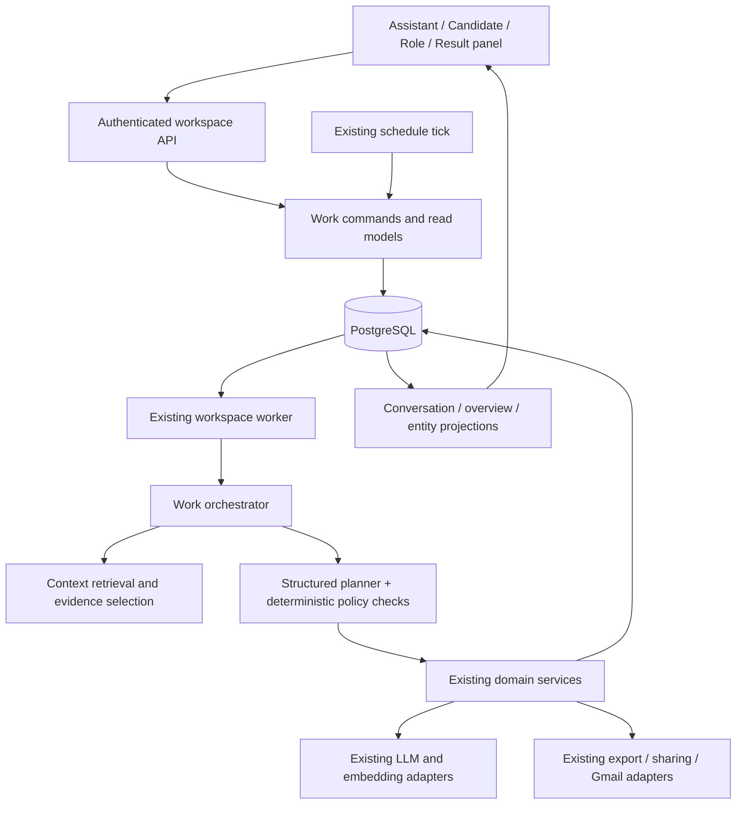
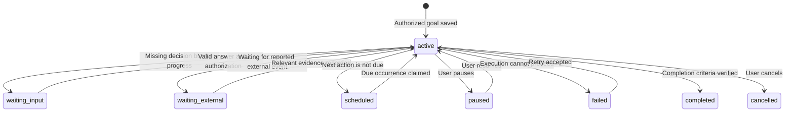

# Hirelix Personal Agent：技术架构与产品交互设计方案

日期：2026-10-08 · 状态：待评审的设计方案 · 代码核对基线：`a3a1a6f`

依据：[八个核心场景与设计原则](personal-agent-core-scenarios.md)。目标用户为海外英语市场的独立猎头与精品猎头顾问；产品界面示例使用英文，首版聚焦桌面浏览器。

本文同时定义产品体验、技术责任、数据与执行契约、实施顺序和验收标准。标为“现有”的内容来自代码检查，不等于本次已完成真实链路验收；其余均为拟议设计。本次只编写方案，不修改产品行为或部署。

## 1. 设计结论

用一套“对话 + 持续工作上下文 + 资料与成果”的结构承载八个场景。用户交代目标，Agent 读取有关事实、执行获授权的步骤、交付成果，在必要时等待决定或外部反馈，并能在以后接续。

主要设计决定：

1. **对话是主要工作入口。** 交代、澄清、执行、修改和交付在对应对话中完成；资料页面仍可直接编辑和发起工作。
2. **工作目标具有持久身份。** 一件事可以跨多轮消息、后台执行和多次访问延续；技术任务完成不等于业务目标完成。
3. **事实、工作、成果各有归属。** 候选人和职位保存业务事实，工作保存目标与进展，文稿保存成果。对话串起这些对象，不复制三套状态。
4. **确认请求必须有具体原因。** 仅有 `draft` 状态不形成待办；真正需要用户决定时，说明缺失信息、影响和可选行动。
5. **沿用现有部署与业务服务。** 保留 Next.js、PostgreSQL、独立 worker 和现有资料/文稿/发送模块。新增最小的工作编排层，先不引入微服务、独立消息中间件或多 Agent 团队。
6. **主动性有范围。** 用户授权的工作和约定可以持续执行；普通问候、新会话和无变化的等待不触发额外任务或催促。

## 2. 现状与真实缺口

| 已核对的代码 | 现有能力 | 本方案需要补足的部分 |
| --- | --- | --- |
| `workspace/conversations.ts` | 消息、资料附件、对象选择、两阶段规划/回答、动作及工作回执；历史主要使用最近 30 条消息 | 将跨轮目标、等待原因与可恢复执行显式保存；检索较早的相关工作上下文，不能靠增加提示词解决延续问题 |
| `workspace/people.ts`、`imports.ts`、`records.ts`、`roles.ts` | 人选、导入、来源记录、职位、候选人与职位关系、版本 | 补足有来源的业务进展和沟通事件结构，统一与工作关联 |
| `workspace/retrieval.ts`、`assessment.ts` | 私有候选人语义检索、覆盖率、按职位评估；相似度与匹配判断分离 | 把检索、评估、补充证据、再比较连成可恢复流程；支持候选人反向找已有职位 |
| `workspace/memories.ts` | 显式偏好存储、修改与忘记，复用 records；执行约定由 schedule 单独负责 | 按任务取相关偏好，联查业务事实与历史工作；遗忘应同时约束派生摘要与索引 |
| `workspace/assistant-work.ts`、`deliverables.ts`、`revisions.ts` | 按授权准备推荐稿/进展稿、文稿版本与修改 | 沟通准备等成果类型；在对话内预览、编辑和接续，避免成果交付后丢失工作上下文 |
| `workspace/schedules.ts` | 按职位生成每周/隔周进展稿、时区、变更检查、失败恢复 | 候选人单次跟进、具体到期事项、约定与工作之间的统一连接；不能把现有角色周报直接称作通用提醒 |
| `workspace/jobs.ts`、`database.ts`、`worker.ts` | 入队幂等键、租约、心跳、失租回收、事务提交、额度控制 | 业务步骤依赖、用户暂停/取消、迟到结果保护、跨步骤恢复；保留已有执行保障 |
| `workspace/gmail.ts`、`document-sharing.ts` | 明确发送动作、文稿版本快照、发送去重、`unknown` 结果处理、分享链接 | 将已有发送回执映射到对应工作；本方案不增加自动收信、自动回复或日历同步承诺 |
| `api/workspace/overview`、`recent-work.tsx` | 最近对话、最近两份草稿、执行任务和角色约定的聚合 | 从工作事实生成可行动摘要；移除“草稿等于待审核”的含义 |

结论：有较多可复用的单项能力；需要重组的是它们之间的持续工作关系、状态与交互。本次未逐项运行八个场景，不据此宣称这些场景已经闭环。

## 3. 产品概念与信息架构

### 3.1 四个用户能理解的概念

| 概念 | 作用 | 举例 |
| --- | --- | --- |
| Conversation | 与助理交代和推进工作的地方 | “Prepare Mira for the next client conversation” |
| Work | 一个有结果标准的受托目标，通常自然嵌在对话里 | 准备面谈、比较三个人、完成一次候选人推荐 |
| Context | 相关候选人、职位、来源资料与历史反馈 | Mira、Harbor Head of Product、上周电话记录 |
| Result | 工作产生的已保存成果或事实回执 | 推荐稿 v3、更新的职位要求、已建立的跟进约定 |

一个职位可以包含多件工作；一件工作也可涉及多个人选或职位。不要把整个职位招聘周期做成一个永不完成的技术任务。一般问题和问候不创建 Work；需要多步执行、持久交付、等待或约定的受托目标才创建。

Work 是底层持久概念，用户无需填写“新建工作”表单。Conversation 是对话载体，两者不能简单一一绑定。新对话可以继续已有工作；一个对话也可处理多个目标。

### 3.2 导航

- `Assistant`：默认入口，新对话、对话历史和与自己相关的工作进展。
- `Candidates`：查找、核对和维护自己积累的人选；详情页可发起带上下文的对话。
- `Roles`：职位要求、人选进展、反馈与相关成果；详情页可继续对应工作。
- 成果通过对话、候选人/职位详情和全局搜索查阅。原 `Submissions` 的列表与直接链接继续可用，但不作为默认主工作入口；导航调整在交互评审后落地。
- 工作偏好和连接管理留在账户设置；已有 `What I remember` 能力提供查阅、纠正和忘记入口。

不新增八个场景菜单，也不新增面向用户的 Jobs、Planner、Memory Engine 等技术页面。

## 4. 三个核心界面

### 4.1 首页：交代事情与接续工作

首次使用只显示简洁介绍、输入区和少量可选示例。已有用户显示与当前状态有关的轻量入口。输入框在常见桌面视口的首屏可见，历史内容不能把它挤到页面下方。

```text
Assistant                                      Search

What would you like me to take care of?
[ Describe the work, or add files…                  ↑ ]

Needs your input                              (有真实阻塞才显示)
Mira · Harbor Head of Product
Two records may refer to different people. Which one is this?
[Resolve in conversation]

Continue working
Harbor shortlist · Compared 3 candidates; 1 needs more evidence
[Continue]

Updates                                       (有新结果才显示)
Your Friday client update is ready.          [Open]
```

显示规则：阻塞决定优先，其次是已经到期的明确约定，再是用户最近参与的未完成工作和未读结果；每组数量受限，提供 `View all`，不无限堆叠。顺序由已保存状态和时间决定；LLM 可以解释重要性，不能虚构紧急程度。

阅读一条结果后取消未读标记，但文稿不因此变成已发送。查看一个问题也不等于解决问题。没有变化就不重复提醒。进入首页不自动消耗 LLM 额度生成长篇日报；用户询问优先事项时再按实际上下文回答。

### 4.2 对话：执行与交付的主要场所

```text
Harbor shortlist                    Context: Harbor / 3 candidates

You: Compare these candidates and prepare an internal recommendation.

Assistant: I’ll compare them against Harbor’s requirements.
  Comparing 3 candidates…                  [Stop]
  ▸ View progress and sources

Assistant: The recommendation is ready. Mira has the strongest evidence
for the product strategy requirement; her team size is still unconfirmed.

[Internal recommendation · v1]             [Open] [Export]

[ Ask a question or request a change…                         ↑ ]
```

一个工作目标只有一个主进度块；检索、评估、撰写作为可展开步骤。重试留在原步骤，新的独立目标显示为新的工作块。结果卡来自已提交成果，不能由模型宣告完成来生成。

用户可直接说“缩短一点”“只比较这两位”“先停一下”。中途修改目标先使旧计划失效，再执行新版本；已经完成并保存的结果保留，明确哪些内容需要重新计算。

`Needs your input` 卡显示具体问题与上下文，支持直接输入答案，必要时提供选择。多个不相干的问题不一次全部抛给用户，只询问阻碍下一步的问题；其他已授权且独立的步骤仍可继续。

### 4.3 右侧详情面板：查看成果与核对资料

在对话中打开人选、职位、来源或成果时，优先使用右侧可关闭面板，保留对话滚动和输入草稿。较窄桌面视口可用可返回的详情页，保存相同上下文。

文稿面板显示用途、版本、来源、正文及必要动作。修改通过对话或直接编辑进行；二者调用同一版本写入服务，冲突时保留用户未保存文本。内部草稿明确标为 `Internal`；对外版本只有在分享范围符合要求时才开放发送/分享。

发送前展示收件人、正文版本和附件；已有明确且仍有效的授权可以复用，不要求重复表达。发送结果为 `unknown` 时明确说明需核实，不显示成功、不自动重发。面板内操作状态同步回原对话，打开独立成果链接也能回到相关工作。

## 5. 八个场景的完整交互契约

下表中的“保存”都以用户指令和既有权限为前提。只要求分析时交付分析，不擅自修改业务资料。

| 场景 | 输入与正常流程 | 持久结果和接续方式 | 应询问或等待的条件 |
| --- | --- | --- | --- |
| S1 接招聘需求 | JD/电话记录 → 识别客户与职位 → 提取要求与来源 → 保存或展示分析 | 职位 brief、来源记录及版本；对话里给出关键理解，后续反馈更新同一职位 | 同名职位无法辨认、要求彼此冲突、缺失信息影响当前动作；一般 unknown 可先保存，不阻塞全部工作 |
| S2 理解候选人 | 简历/笔记 → 身份匹配 → 提取事实 → 无歧义时按授权新增或补充 → 更新检索索引 | 人选、原始资料、发生时间与记录时间、保存回执；索引未完成时明确覆盖边界 | 同名身份、事实冲突、用户未授权的覆盖；只隔离受影响的人选，其余可继续 |
| S3 已有资源匹配 | 选择职位/人选 → 检索相关对象 → 读取证据 → 按具体职位评估 → 比较 | 比较结果引用人选/职位及证据版本；可接着补证据或准备沟通 | 索引覆盖不足、职位条件不明确；不能用语义相似度假装评估，不自动否决候选人 |
| S4 准备沟通 | “下午和 Mira 聊” → 回顾相关联系记录 → 明确目标 → 生成问题与介绍 | 沟通准备稿作为内部成果；会后笔记作为来源记录，接续原工作或创建新的跟进工作 | 不知道本次沟通对象/目标且无法消歧；不会自动录音、创建日历或发送邀请 |
| S5 推荐候选人 | 选定人选与职位 → 核对证据/分享范围 → 形成推荐 → 对话内修改 → 按授权交付 | 文稿版本、使用范围、分享/发送回执；“写好推荐稿”在稿件交付后即可完成 | 私人信息分享范围不清、真实发送缺收件人或授权；起草可以先做，不把发送前置条件强加给内部分析 |
| S6 面试与反馈 | 用户报告反馈/结果 → 记录事件 → 更新人选—职位进展 → 检查旧判断是否过时 → 推进已授权下一步 | 业务阶段、面试事件和来源，标为需重评的旧评估；准备下轮问题/沟通 | 反馈指代不清、时间矛盾；尚未收到的反馈显示“等待客户”，不能暗示已连接收件箱 |
| S7 关系与约定 | 一次或重复约定 → 解析范围和本地时间 → 保存可执行约定 → 到期触发 → 原对话交付 | 独立于对话窗口存活的 schedule、每次执行的 work、回执与暂停入口 | “11 月”只形成待定时间意图并询问具体日期；不能擅自选择日期或把记忆当作闹钟 |
| S8 工作回顾 | 用户问优先事项 → 聚合到期约定/真实阻塞/外部等待/近期变更 → 给出少量有依据的建议 | 可定位的工作引用、原因和下一步；用户选择后延续同一工作或授权新工作 | 没有日期不捏造逾期；没有更新不重复制造紧急事项；建议本身不授权执行 |

反向匹配首版可对当前用户已有的 active roles 分页检索和评估，复用职位 brief；规模达到需要时再增加职位索引，不能直接截取最近若干职位后声称搜索了全部。

## 6. 技术架构与模块责任



部署保持 Vercel 承载 Next.js 页面/API，`us-2` 承载 PostgreSQL 和 scheduler/worker。API 保存指令与入队后返回；长时间 LLM、文件处理和编排不依赖浏览器存活，也不在 Vercel 请求内等待完整任务完成。

| 模块 owner | 拟议责任与修改方式 |
| --- | --- |
| `conversations.ts` | 保留消息入口、身份与上下文关联；逐步将规划/动作执行拆给明确模块，避免继续扩充单个超长提示词流程 |
| 新 `workspace/work.ts` | 工作命令、状态约束、版本、完成条件、暂停/恢复/取消；唯一工作状态写入入口 |
| 新 `workspace/orchestrator.ts` | 读取当前计划，派发已就绪步骤，接收步骤结果，必要时继续规划；不重复实现 domain 写入 |
| 新 `workspace/context.ts` | 按工作范围选择事实、偏好、相关历史与成果，生成可追溯的上下文清单；依赖现有 retrieval/records 服务 |
| 新 `workspace/work-policy.ts` | 验证操作类型、对象归属、授权范围、版本、预算与副作用要求；LLM 不能通过自己的输出赋予权限 |
| 现有 people/roles/records/assessment/deliverables/revisions | 各自负责业务校验和原子写入；界面、Agent 和定时工作调用相同服务 |
| 现有 jobs/worker/database | 队列、租约、事务、执行恢复和额度；增加步骤关联及取消检查，不建立第二个执行队列 |
| 现有 schedules | 通用约定的时间与触发 owner；在该模块扩展单次提醒与目标类型，不另建提醒服务 |
| 新 `workspace/overview.ts` | 聚合确定性状态与最近变更，输出首页/工作回顾的共享事实视图 |
| 前端 workspace 组件 | 通用工作块、确认问题、成果卡和详情面板；不在前端推算工作成功、到期或授权 |

模型负责自然语言理解、证据判断、可审查计划和表达；确定性代码负责租户权限、状态转换、版本、幂等、时间、预算和外部副作用。初版采用一个编排器调用能力服务，八个场景不是八个 Agent。

## 7. 最小数据设计

### 7.1 复用与扩展

| 现有数据 | 目标职责与必要扩展 |
| --- | --- |
| `hirelix_agent_people` / `hirelix_private_roles` | 继续承载人选与职位；保留原始 JD 和版本。不为“上下文”复制一套候选人/职位 |
| `hirelix_private_records` | 保存电话、反馈、邮件摘录和事件；对 `details` 按类型加 schema，含 `source_message_id`、`certainty`、`supersedes_record_id` 等；发生时间与记录时间分开 |
| `hirelix_private_role_candidates` | 增加有来源的业务阶段和阶段更新时间；如 considered/contacted/submitted/interviewing/offer/placed/closed，允许纠正，不强迫单向流水线；面试轮次等细节用 event records 表达 |
| conversations / messages | 继续保存对话；消息 metadata 中加入经验证的 `work_ids`、`result_refs` 与 `context_refs`。一条消息涉及多项工作时分别关联，不靠文本标题匹配 |
| deliverables / versions | 扩展内部 `conversation_brief` 等成果类型及 `audience`；候选人沟通稿可无 role，新增带 owner 校验的 person 关联。现有 submission/search_update 仍要求 role；独立内部成果不能伪装成 client submission |
| schedules | 增加 `kind`（reminder / prepare_update）、单次/重复类型、可选 person/role、源消息、授权范围和版本。移除“每个 role 只能一条约定”的通用限制，使用显式 schedule ID 编辑；沿用同一调度 owner |
| notifications | 只作为未读结果/到期提醒入口，引用 work/step；已读与工作解决分开，去重键确保同一次结果只提醒一次 |
| email_deliveries / document_shares | 保持外发结果与快照的唯一事实来源，Work 引用回执，不复制外部投递状态 |

暂不引入独立 Client CRM 实体。客户偏好可记录在对应职位来源中；需要跨多个职位使用时，先明确其适用范围，不能仅按相同 `client_name` 自动合并公司或联系人。跨职位客户主数据可另立需求评估。

### 7.2 新增两张工作表（建议字段，不是已执行 DDL）

`hirelix_private_work_items`：

- `id, user_id, origin_conversation_id, origin_message_id, request_key`。
- `title, objective, kind, scope`：scope 是经 schema 校验的对象引用，不含完整业务资料副本。
- `completion_criteria`：可检查的结果要求，例如“指定三人比较完成，内部推荐稿已保存”；模型描述加允许的结果类型，由服务验证。
- `status, version, plan_revision, authorization`：授权引用用户源消息/已保存 schedule 及其版本，包含目标、对象、允许操作和分享范围。
- `summary, summary_source_refs, summary_version`：摘要是可重建缓存；来源变化使它失效。
- `due_at, created_at, updated_at, completed_at`。

`hirelix_private_work_steps`：

- `id, user_id, work_id, plan_revision, ordinal, operation, args, depends_on`。
- `status, version, active_job_id, result_refs, input_versions, error_code`。
- `wait_kind, question, answer_schema, wait_target, resume_after`：只在需要输入/外部事件/到期等待时使用。
- `decision_message_id, authorization_ref, idempotency_key, created_at, updated_at`。

约束：所有关联包含 `user_id` 并核对归属；`(user_id, request_key)` 和步骤幂等键唯一；依赖只能引用同一工作有效计划中的步骤且无环；状态更新使用预期版本和事务。JSON 引用由共享 schema 与 domain 服务校验，不能只信模型生成的 UUID。

jobs 增加 `work_id, step_id, plan_revision` 关联。业务步骤状态由编排层维护，job 是该步骤的一次可恢复执行载体。初版每个工作按依赖串行推进，独立工作由现有 worker 并发处理，先不做通用 DAG 并行执行引擎。

不新增“审批单”“长期记忆库”“客户任务板”等重复实体。确认是工作步骤的等待状态；偏好仍归 memories；时间约定仍归 schedules。

## 8. 状态、授权与执行协议

### 8.1 工作和步骤状态

工作状态：`active / waiting_input / waiting_external / scheduled / paused / failed / completed / cancelled`。步骤状态：`pending / queued / running / waiting_input / waiting_external / done / failed / cancelled / superseded`。

工作状态由同一事务中的有效步骤、用户控制状态和完成条件计算后持久化。仍有可执行步骤时为 active；全部剩余步骤受阻才进入等待。暂停/取消是显式控制；不能由 UI 读取单个 job 状态推断。



图示为主要路径；所有非终态允许用户暂停或取消，恢复时重新计算是执行、等待还是 scheduled。完成/取消的工作不会因轮询或重试自动重开；后续新目标创建关联的新工作。来源更新不会把已交付成果“变成没完成”，而是标明版本可能过时。

### 8.2 一次指令的执行

1. API 验证身份、请求键和附件归属，保存用户消息。重复相同请求返回原记录，不重复建任务。
2. 规划阶段根据当前消息和明确上下文判断是回答、继续工作还是新工作；有多个可能目标才消歧，不按标题相似度静默合并。
3. 建立或更新 Work，保存计划版本、授权和结果要求，事务内入队首个可执行步骤。
4. worker 按现有租约机制执行；每一步调用已有 domain 服务，运行前重读权限、授权版本和关键输入版本。
5. 保存业务结果、步骤回执、完成状态、下一步入队及对话结果引用时保持事务一致。LLM 调用在事务外，长事务不跨网络。
6. 编排器只在结果持久化后推进。必要时重新规划未完成部分；限制自动规划轮数、总调用预算及单步时间，超出后如实交付已完成部分和阻塞。
7. 浏览器通过现有查询/轮询读取共享投影，刷新或关闭后仍可恢复。首版保留轮询，不为展示进度强制增加 SSE 基础设施。

### 8.3 授权规则

| 请求 | 默认处理 |
| --- | --- |
| “分析这份简历” | 读取和分析；不创建人选档案 |
| “保存这些候选人” | 无歧义部分直接保存；身份或事实冲突才询问 |
| “准备推荐稿” | 保存约定用途的草稿；不默认发送，也不默认公开私人笔记 |
| “把这版发给 X” | 校验收件人、文稿确切版本、附件、候选人分享范围和连接权限；条件齐全再调用已有发送服务 |
| “每周五准备进展” | 保存可执行约定后按范围运行；没有具体时间/时区时补齐。它不授权每周自动发送 |
| “先停一下” | 取消未来步骤派发，当前步骤尽快协作停止；已发生的外部动作和已保存成果仍如实展示 |

跨轮授权持续有效，直到用户撤回、范围改变、相关版本失效或约定结束。不能要求每个子步骤都从“最新消息”重新抽取一句授权；也不能把一次任务授权扩展为以后所有任务。源消息中存在一段文字只是证据之一，操作类型、对象、用途和版本必须共同校验。

外部副作用不可与数据库实现真正的单事务：沿用发送服务的先登记回执、请求指纹去重、提供方确认后落状态流程。超时可能已发送时保持 `unknown`，先核实再重试。用户取消时若发送已进入请求阶段，明确“可能已经发送”，不能承诺撤回。

### 8.4 失败、冲突与中断

- worker 崩溃：租约回收同一 job，已成功步骤不重跑；每个写操作使用步骤幂等键。
- 用户改变目标：锁定 Work，增加 `plan_revision`，旧未完成步骤标为 superseded；旧执行即使返回也不能覆盖当前结果。落库同时检查 job 租约和工作/计划版本。
- 多标签页修改：沿用 `expected_version`，冲突时保留用户输入，展示当前版本差异；不静默覆盖。
- 输入数据变更：检查 `input_versions`；重新评估受影响步骤。已发送内容保留快照，不能回写为“发送了新版”。
- 附件解析或检索失败：保存原资料和明确错误；不以空文本完成分析，也不把未索引的人判成不存在。
- 额度不足：停止新的计费执行，保留资料和已完成结果；恢复前重新检查额度。工作层复用现有 job 计费 owner，新增内部步骤的计费归属需明确，不能因拆步骤重复计算同一交付。

## 9. 上下文、检索与长期记忆

每次执行先建立 `ContextManifest`：当前用户指令、有效工作目标与计划版本、关联对象及版本、证据引用、适用偏好、已有成果和明确未覆盖范围。

读取顺序：当前消息与直接引用 → 工作持久状态 → 最新关联事实 → 相关历史记录/对话 → 适用偏好。历史摘要用于定位来源，不作为覆盖原始事实的更高权威。冲突保留来源，重要缺口交给用户澄清。

不要每次把所有职位、所有偏好和全部对话塞给模型。按 owner 与业务范围检索后选证据，检索命中再读取原始内容；保留 token 预算、覆盖率、截断原因。现有候选人向量索引继续复用，历史对话先采用对象引用与数据库文本检索，确有检索质量证据后再扩展向量索引。

业务变更和偏好变更应使相关缓存摘要失效；候选人索引继续按内容版本更新。忘记/归档的偏好在上下文生成时始终过滤，摘要不得重新带回；删除资料后的索引、摘要与结果访问按已有删除规则联动。对外成果只使用授权范围内的来源，不能把整个内部上下文直接交给生成外发正文的调用。

## 10. 约定、事件与主动性

同一个 schedules 模块支持单次提醒和现有重复进展稿。保存 IANA 时区、本地规则和下一次 UTC 时间，展示真实下一次触发时刻；使用已有 PostgreSQL 时区计算方法，补充夏令时和重复时间验收。

触发一次约定时，在一个数据库事务内锁定 schedule、生成唯一 occurrence key、创建 Work/首步并推进下次时间。多个 worker 或服务重启不能造成重复提醒/重复文稿。暂停、编辑或删除约定后，未开始的 occurrence 需失效；执行中的结果提交再核对授权版本。

停机后错过单次提醒时，恢复后只补发一次并显示原到期时间，不改写为刚刚到期。重复进展稿错过多期时，默认准备一份覆盖尚未交付期间的更新，记录实际覆盖区间和跳过的触发次数，避免恢复时批量生成多份相似稿件；用户明确要求逐期材料时才分开处理。暂停后恢复先展示下一次执行时间，不能悄悄补跑暂停期间的工作。

触发来源限定为用户消息、已保存业务事件、到期约定和用户显式重试。候选人“等待客户反馈”默认只能由用户提供的新记录解除，不能凭时间过去推断客户回应。收件箱监听、日历连接、主动外联作为后续独立能力，不是八个场景首版的隐藏依赖。

业务写入成功后事务内入队有依赖的刷新/编排步骤，复用 PostgreSQL jobs，不引入第二套消息系统。通知只在新结果、明确到期或需要决定的变化时发出；无变化保持安静。未读通知数不等于未完成工作数。

## 11. API 与前端契约

保留 `/api/workspace/*` 身份与 owner 校验。以下为拟议增量：

| 接口 | 职责 |
| --- | --- |
| `POST /conversations`（扩展现有） | 接受已有 `work_id` 或明确对象上下文、消息 request key；服务端校验关联，返回消息/工作引用 |
| `GET /conversations/:id`（扩展现有） | 一并返回关联工作、有效步骤、真实问题和成果引用，避免前端用消息文本反推状态 |
| `GET /work/:id` | 读取目标、状态、步骤、来源范围、成果与版本 |
| `POST /work/:id/commands` | pause/resume/cancel/retry/answer，含 request key、expected version；回答绑定具体 step/version，过期问题返回冲突 |
| `GET /overview`（重构现有） | `needs_input / due / continuing / unread_results`；响应提供生成时间和明确排序，不按 draft 列表充当审批 |
| schedules API（扩展） | 对显式 schedule ID 新建/修改/暂停，兼容现有 role 页面调用方式需在切换时统一更新；无需为废弃测试接口建立长期兼容层 |

详情面板与独立页面使用同一组件和查询键。落库成功后刷新对话、work、overview 和相关 entity 查询；多个页面看到一致状态。错误保留用户输入，加载态不显示空列表为“没有工作”。

新增英文文案为默认，沿用现有中英文机制。关键状态和按钮支持键盘操作、可见焦点和读屏；结果完成使用适度状态提示，不以持续动画替代真实状态。

## 12. 分阶段落地

每阶段按完整用户路径验收，代码存在或 unit tests 通过不等于场景完成。

| 阶段 | 范围与交付 | 阶段出口 |
| --- | --- | --- |
| P0 设计确认与基线 | 用 S1–S8 固定故事核对现有行为；评审本方案的首页/对话/面板和状态；记录可复用能力与缺口 | 确认交互与数据契约，有逐场景基线；不先用换文案代表架构完成 |
| P1 持续工作骨架 | 两张工作表、最小编排、权限与版本、执行回执、暂停/恢复；先接 S1→S2→S3 | 新对话能恢复同一目标；候选人/职位写入和匹配证据可追溯；停止与崩溃后无重复写入 |
| P2 沟通与推荐交付 | S4/S5、内部准备稿、对话内成果面板、修改版本、现有导出/发送回执连接 | 从比较到沟通准备/推荐修改不丢上下文；外发有确切版本与回执；未知发送不重发 |
| P3 反馈与约定 | S6/S7、业务事件/阶段、评估失效、单次提醒、扩展现有重复计划 | 反馈能影响下一步；跨时区、重启、暂停与修改约定不重复执行 |
| P4 统一首页与工作回顾 | S8、基于工作事实的首页、未读去重、优先事项回答、搜索接续 | 首页每个提醒可解释；无草稿伪审批；八场景串联验收通过 |

P1 起就用最小对话工作块验证底层状态；P4 完成首页聚合，不把全部交互验证拖到最后。数据变更使用显式 SQL migration 和备份回滚方案；保留已有资料、对话与文稿，不把历史 draft 自动批量转成 active work，也不清除用户数据。历史成果仍可查阅，用户明确要求继续时才关联新工作。

产品尚无既有付费用户兼容要求不意味着可以删除现有资料。优先原位扩展和分阶段接入；不并行维护两套执行/调度 owner。每阶段独立提交与验收，正式部署按当次授权执行。

## 13. 场景验收与质量证据

使用明确标记的虚构猎头资料作为真实系统输入，调用真实数据库、worker、模型和浏览器链路；这不等于用 mock 替代依赖。真实对外发送只在明确授权的收件人上验收；未获授权或连接不可用应单列未验收，不包装为通过。

| 场景 | 必测的成功路径 | 关键反例/中断 |
| --- | --- | --- |
| S1 | JD 加通话记录形成有来源的需求；后续客户反馈更新版本 | 两个同名职位不串数据；分析请求不落库 |
| S2 | 已授权混合资料入库，已有候选人补充记录并可检索 | 同名冲突不误合并；部分解析失败保留资料且不假报成功 |
| S3 | 人找职位与职位找人均给出具体证据、未知项和覆盖范围 | 索引不全如实说明；职位修改后旧评估不能继续当作最新 |
| S4 | 旧沟通影响准备稿；会后记录能在下次对话使用 | 多人/多职位指代不明时澄清，不捏造历史或日历事件 |
| S5 | 对话完成起草、修改、导出，内容与持久版本一致 | 取消、并发编辑、未授权私人来源；发送 unknown 后不自动重试 |
| S6 | 面试反馈记录与业务阶段一致，后续问题基于反馈更新 | 候选人撤回与客户拒绝分开；未来事件不记成已经发生 |
| S7 | 关掉浏览器、重启 worker 后到期只执行一次 | 夏令时、错过触发、暂停/修改/取消与运行竞争、失败重试 |
| S8 | 依据实际待决问题/约定解释优先级，并返回正确对话 | 无变化不重复提醒；已读不等于完成；普通问候不擅自推荐工作 |

跨场景要求：租户隔离；来源版本与成果一致；失租后不能提交旧结果；用户更正/取消生效；通知去重；额度不足状态真实；新对话能接续但不会误接另一项工作。

观测字段复用结构化 logger，增加 `work_id / step_id / plan_revision / job_id / result_id`，记录状态变化和耗时，禁止日志包含私人正文或凭据。评估关注场景完成率、恢复成功率、误关联、无必要确认、重复写入/外发及真实到期执行。性能目标在 P0 记录基线后确定，不在无测量时承诺秒级完成。

## 14. 本轮建议与评审边界

建议采用本文的“两张工作表 + 现有 jobs/schedules + 对话与详情面板”方案。仅继续加提示词难以解决持久状态与恢复；现在引入通用流程平台、多 Agent 系统或完整 CRM 则增加不必要复杂度。

优先评审三项产品选择：主导航是否将成果降为辅助入口；对话内面板是否作为默认成果查看方式；首页是否严格只突出真实待决事项和到期约定。本文给出推荐默认值，尚不将其视为已批准的界面重构。

暂不纳入：外部付费寻访、团队权限与多级审批、收件箱全量同步、自动日历安排、无逐项授权的自动外联、移动端首发、独立 Client CRM。以后引入时应单独定义其价值、权限与真实链路验收。

## 15. 代码索引

- [对话与规划](../../src/lib/workspace/conversations.ts)、[Agent 工作入口](../../src/lib/workspace/assistant-work.ts)
- [业务类型](../../src/lib/workspace/types.ts)、[数据归属与版本](../../src/lib/workspace/database.ts)
- [候选人检索](../../src/lib/workspace/retrieval.ts)、[职位评估](../../src/lib/workspace/assessment.ts)、[人选职位关系](../../src/lib/workspace/roles.ts)
- [偏好记忆](../../src/lib/workspace/memories.ts)、[约定调度](../../src/lib/workspace/schedules.ts)
- [任务执行](../../src/lib/workspace/jobs.ts)、[独立 worker](../../src/lib/workspace/worker.ts)
- [文稿](../../src/lib/workspace/deliverables.ts)、[修改](../../src/lib/workspace/revisions.ts)、[Gmail](../../src/lib/workspace/gmail.ts)
- [首页聚合](../../src/app/(product)/api/workspace/overview/route.ts)、[首页工作列表](../../src/components/workspace/recent-work.tsx)
