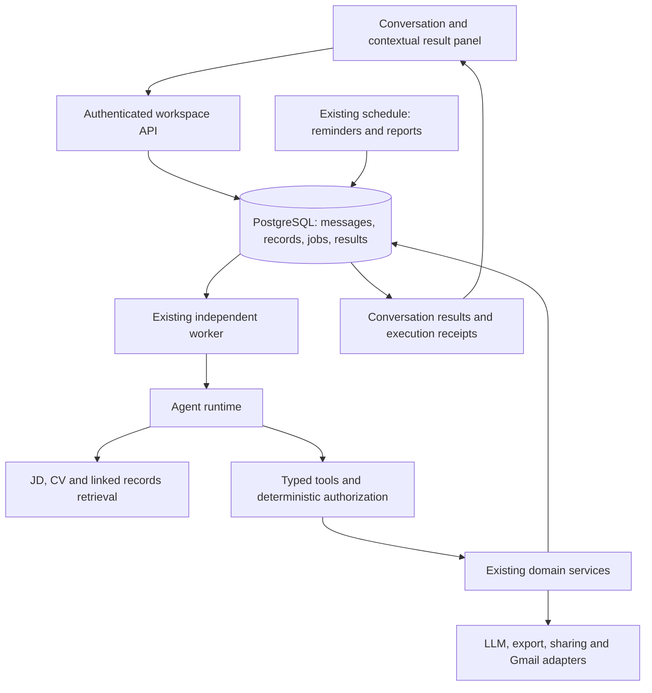

# Hirelix Personal Agent：技术架构与产品交互设计方案

日期：2026-10-08 · 版本：3 · 状态：核心链路已在本地实现，生产尚未部署

依据：[八个核心场景与设计原则](personal-agent-core-scenarios.md)。目标用户是海外英语市场的独立猎头与精品猎头顾问，界面以英文为默认，首版聚焦桌面浏览器。

现有能力的代码核对基线为 `a3a1a6f`；外部产品依据为 2026-10-08 的 Exa 调研，来源见文末。本文描述目标设计；实际已实现范围、测试证据与未验收边界见[实现与验收记录](personal-agent-v3-verification.md)，不能将目标设计等同生产可用性。

## 1. 本次修订的产品决定

**产品围绕持续对话、资料检索、工具执行、长期委托、成果交付五项能力组织，组合支持八个猎头场景。**

用户交代想完成的事情，Agent 使用已有上下文执行，并把结果带回对话。用户接着提问、补充资料、改变要求或停止执行，无需先选择业务流程或维护任务状态。

本轮明确剔除以下面向用户的机制：

- 待办中心、待审核草稿列表、草稿审批队列，以及按阶段要求用户逐项处理的流程。
- “生成草稿 → 用户审核 → 应用”的统一必经路径。明确授权、无歧义的整理、更新和成果制作直接完成。
- 将 `Needs your input / Due / Continue working / Updates` 固定组成首页工作面板的上一版方案。真实问题与结果在所属对话中出现，不换名重建待办中心。
- 要求用户理解、创建、分配或关闭 Work 对象；八个场景也不各自建立一套表单和状态机。
- 默认独立的草稿管理或候选人推荐审批入口。已有成果通过对话、相关人选/职位和搜索访问。

执行恢复、结果版本、外发回执、真实歧义澄清与授权校验仍由系统承担。用户明确要求“先写个草稿”时照做；“草稿”仅描述这份内容的用途，不自动产生审批义务。移除产品机制不等于删除用户已有成果或取消真实发送所需的权限检查。

技术取舍按 **数据正确与隔离 > 工程稳定、可维护 > 智能效果与自动化程度** 排序。允许召回不够全面、需要用户补充关键词或指定对象、重启后重新计算部分分析；不允许丢失原资料、混用用户数据、重复外发或把失败说成成功。

首版的长期能力首先是：**以前上传的 JD 和简历能找回来，Agent 能读取原文并继续工作。** 不以复杂自动记忆系统作为八个场景的前置条件。

上一版强制新增 `work_items / work_steps` 两张业务工作表的方案撤回。先扩展现有执行与调度能力，使持久执行服务于对话；不为首页待办反向创造业务实体。

## 2. 外部产品提供了什么依据

Exa 调研覆盖 7 组检索、35 条返回结果和 8 篇官方原文读取，选取 6 个代表性产品；不是市场份额排名，也未实际体验全部产品。

| 产品 | 官方文档支持的观察 | 对 Hirelix 的启发 |
| --- | --- | --- |
| Lindy | 用对话交代目标，结合工具、会议和资料完成成果，在同一对话修改；有记忆、Skills、Routines；首页仍存在活动及关注事项卡片 [1][2] | 学习连续交付和上下文积累，不照搬首页卡片 |
| OpenClaw | 主会话承接日常交流、后台回报与主动唤醒，通过持久记忆延续上下文 [3] | 用户感受到一个持续存在的助理，底层可有多个执行会话 |
| Claude / Cowork | 交代结果后执行多步工作，提供文件成果、项目上下文与记忆；聊天和任务入口正在逐步统一 [4] | 用户无需先判断“这是聊天还是工作”，成果直接可用 |
| Manus | 项目复用指令和资料，任务可按时间执行并交付指定结果；明确保留任务列表和计划管理 [5][6] | 复用工作方式和长期委托；不据此强制用户维护任务 |
| Gemini Spark | 在对话中交代目标，使用应用、Skills、时间/事件触发，工作面板提供控制 [7] | 自然语言委托与跨工具执行；应用权限和可用范围需独立验证 |
| Perplexity Personal Computer | 使用本地文件、应用和语音，支持持续后台执行及远程发起/调整 [8] | 让 Agent 实际处理资料和工具，而非只给操作建议 |

研究结论与产品选择分开：不能声称“主流 Agent 都没有任务、草稿或确认”。Hirelix 剔除待办/草稿工作流，是根据猎头个人助理定位与用户反馈作出的选择；长期上下文、实际执行、委托和对话交付是可以借鉴的共性。

## 3. 五项核心能力

| 能力 | 用户体验 | 技术责任 |
| --- | --- | --- |
| 持续对话 | 随时交代事情，接着上次说，补充、更正、停止 | 对话引用、相关历史检索、当前执行控制，跨会话消歧 |
| 资料检索 | 找回以前的 JD、简历及关联笔记，继续使用 | 原文、对象关联、统一检索与来源引用；偏好只显式保存，约定由调度保存 |
| 工具执行 | 保存资料、查找匹配、比较、修改、导出和获授权的发送 | 一个 Agent 运行循环调用已有领域服务，校验输入和实际返回结果 |
| 长期委托 | “每周五整理进展”“下个月提醒我联系他” | 限定为单次提醒和固定周期报告，复用持久调度、去重、暂停和撤销 |
| 成果交付 | 直接得到答案、比较、文件或已完成操作，并继续修改 | 适合目标的结果形态、持久版本、来源与实际回执 |

工作方式可复用：记住用户明确要求的推荐格式、评估习惯或客户更新方式，按相关性使用。先复用现有偏好与受控能力模板；不新增面向用户的技能搭建器，也不因竞品具有 Skills 就引入插件市场。

## 4. 产品交互设计

[可点击英文原型](prototypes/personal-agent-v3.html)及[验证范围记录](personal-agent-v3-verification.md)用于核对布局与交互。原型是虚构示例，不代表新业务能力已实现。

### 4.1 默认进入助理对话

初次进入显示简洁开场和输入框，可有少量示例。已使用用户默认恢复最近的助理对话，并提供清楚的“新对话”和历史搜索入口；后续是否采用固定主会话可通过原型验证，不把所有历史无差别塞进同一模型上下文。

首页不展示待办、审批、草稿数量或工作阶段看板。后台结果在对应对话中交付，对话历史用未读标记提示；点击定位到新消息。结果出现不应抢走用户当前正在输入的对话。

```text
Hirelix                           Mira · Harbor Head of Product

Conversations                     You:
  Mira · Harbor                   Compare my candidates for this role and
  Weekly client update •          tell me which three I should speak to.
  Search
                                  Hirelix:
Library                           I found three worth discussing. Mira has…
  Candidates                      [Candidate comparison] [Open]
  Roles
                                  You:
                                  Prepare me for the conversation with Mira.

                                  [ Message Hirelix, or add files…          ↑ ]
```

Library 是辅助资料入口，候选人和职位可以查找、核对和直接编辑。成果通过相关对话、资料详情和搜索访问；原 Submissions 主导航退出默认体验，保留已有成果的访问能力。设置中提供偏好、连接和长期委托的查看/暂停控制；这些是可控性入口，不是每日必处理清单。

### 4.2 在对话中执行和接续

- 简单问题直接回答，不创建用户可见任务卡；保存请求直接操作并给出保存回执。
- 多步执行显示一段简短真实进展，如 `Comparing 3 candidates…`，提供 `Stop` 和可展开的执行详情。默认不展示完整计划表或勾选清单。
- 结果落库后交付正文、比较表或文件；不能以“我准备好了”的模型文本代替真实结果。
- 同一执行的重试留在原执行详情中，独立的新目标单独呈现；不把失败重试包装成新成果。
- 有实质问题时在对话里直接问，例如“这两份记录是否属于同一个 Mira？”用户直接回答即可；不转入审批中心。
- “缩短一点”“只看这两位”“先停一下”是正常对话指令。更正先使旧执行失效，再按新要求执行；提交前检查停止状态和对象版本，避免旧结果覆盖更正。
- 新对话提到旧事时检索相关事实和成果；多个可能对象才澄清，不要求用户手动选择一个 Work ID。

### 4.3 成果形态由目标决定

| 用户目标 | 默认交付 |
| --- | --- |
| 问题、解释、优先级建议 | 对话回答，附必要证据与可打开的对象引用 |
| 比较候选人 | 对话中的结构化比较，可继续追问；不强制生成文稿 |
| 保存或更新资料 | 已保存的事实摘要和对象链接；不先生成“待审核更新” |
| 准备沟通 | 可直接使用的问题和沟通要点；长内容或明确文件需求时形成可打开的成果 |
| 制作推荐材料、客户报告 | 已保存、可修改和导出的成果，说明内部/对外用途；不会因为未发送而变成待办 |
| 发给具体收件人 | 在授权与分享范围满足时执行，并交付实际发送结果 |
| 长期委托 | 确切的范围、下一次触发时间、暂停入口；每次结果回到对话 |

在对话中打开长文稿、人选或来源时，使用可关闭的详情面板，保留输入内容和滚动位置；独立详情页复用同一组件。小视口可切为可返回页面。

成果面板提供内容、用途、来源、版本和必要操作，不提供通用“审核通过”按钮。直接编辑和对话修改使用同一写入服务。点击查看不改变业务完成或发送状态；修改冲突保留用户输入。

### 4.4 自主执行与真实确认

授权清楚、对象无歧义的操作直接完成。只要求分析时不修改资料；要求先预览时才提供可确认的预览。外发必须符合收件人、内容、附件和分享范围授权，已有仍有效的明确授权不重复索取。

需要确认的是具体动作或事实，而非“每个生成结果都必须审核”。内容版本、收件人或分享范围改变时重验授权。发送结果未知时明确说明需核实，不假报成功、不自动重发。

普通问候不触发未完成工作播报。只有新结果、明确约定或影响当前工作的变化才主动告知；“今天该推进什么”由用户询问或明确订阅的简报触发，不在每次打开产品时生成待办清单。

## 5. 八个场景如何由能力组合完成

以下是典型故事，不是用户必须按顺序完成的八套流程。

| 场景 | 典型交互与直接交付 | 需要延续的上下文 | 真正的边界 |
| --- | --- | --- | --- |
| S1 接招聘需求 | 发来 JD 和电话记录，Agent 理解要求；授权保存时直接形成职位资料并说明要点 | 原始 JD、客户反馈、要求变化及来源 | 同名职位或冲突要求需消歧；只分析则不建档 |
| S2 理解候选人 | 发来简历和笔记，授权整理后直接新增或更新已有候选人 | 身份、经历、意愿、记录发生时间、信息来源 | 身份和事实冲突只阻塞受影响部分，不让全部资料进入审核队列 |
| S3 已有资源匹配 | “谁适合这个职位？”→ 返回有理由、风险和证据的比较；可反向问人选适合哪些职位 | 候选人—职位组合及被评估的版本 | 相似度不等于匹配判断；检索不全需说明，不能伪称覆盖全部 |
| S4 准备沟通 | “下午和 Mira 聊”→ 返回历史回顾、核实问题和介绍要点；会后补充笔记即可继续 | 相关沟通历史、目标、候选人关注点 | 不捏造日历、录音或未经记录的对话 |
| S5 推荐候选人 | 直接形成推荐材料，用户在同一对话修改、导出或要求发送 | 人选、职位、证据、成果版本和用途 | 准备材料不自动授权发送；也不要求为起草完成一次发送审批 |
| S6 面试与反馈 | 报告反馈后保存相关事实，更新有证据的进展，按委托调整比较或准备后续沟通 | 谁反馈、何时发生、对要求和判断的影响 | 不把缺席反馈推断为拒绝，不自动代替猎头作出录用判断 |
| S7 关系与约定 | 自然语言委托定时提醒/准备材料；Agent 按约执行，结果回到对话 | 对象、目的、时间/周期、授权和最近执行结果 | 模糊日期需澄清；首版仅支持一次提醒和固定周期报告，记住一句话不等于计划已建立 |
| S8 工作回顾 | 用户问优先级，Agent 依据已知反馈和承诺解释少量值得推进的事项，用户继续委托即可 | 最近变化、明确日期、外部等待和已完成结果 | 不创建待办对象、不虚构紧急度，建议不自动授权执行 |

完整验收故事：接下职位 → 整理人选 → 比较匹配 → 准备沟通 → 吸收笔记 → 制作推荐 → 收到反馈后调整 → 按约后续联系。用户可以从任一步进入或改变方向。

## 6. 现有能力与架构调整

| 现有 owner | 已核对能力 | 目标调整 |
| --- | --- | --- |
| `conversations.ts` | 消息/附件、对象选择、规划与回答、动作回执，主要使用最近 30 条消息 | 统一回答与执行入口；增加对象关联资料检索和对话接续，按实际需要拆分函数，不先建通用运行框架 |
| people / imports / records / roles | 人选、导入、来源记录、职位与关系、版本 | 无歧义授权写入直达原服务；事实冲突局部澄清，保留来源 |
| retrieval / assessment | 私有候选人检索、覆盖率、按职位评估 | 复用候选人检索，补齐 JD 检索并交付比较；说明实际覆盖范围 |
| memories | 显式偏好、修改与忘记 | 只保留显式偏好及修改/删除，不加自动提取、仲裁或摘要系统 |
| assistant-work / deliverables / revisions | 推荐/进展稿生成、版本与修改 | 将成果制作作为可调用工具，去除统一审核门槛；支持内部沟通材料，简短回答无需建文稿 |
| jobs / database / worker | 幂等、租约、心跳、失租回收、事务提交、额度控制 | 复用已完成业务结果，补齐停止与迟到结果保护；不建通用检查点系统 |
| schedules | 职位周/隔周进展稿、时区、变更检查 | 有限扩展为单次提醒和固定周期报告，结果直接回对话；暂不支持事件规则 |
| gmail / document-sharing | 发送和分享快照、去重、unknown 回执 | Agent 调用相同服务，结果回对话；保留具体动作的授权，不新增通用审批层 |
| overview / recent-work | 对话、草稿、任务、角色约定聚合 | 移除首页待办/草稿聚合契约；按需提供对话接续、未读结果和工作回顾的事实检索 |

这些是代码层面的复用判断，未在本轮重新验收真实业务链路。

## 7. 技术架构：一个 Agent 调用受控能力



部署继续使用 Vercel Next.js + `us-2` PostgreSQL/scheduler/worker。请求保存后返回，长执行由 worker 承担；关掉浏览器不终止委托。先保留现有轮询，不为进度显示强制引入 SSE、消息中间件或微服务。

建议从现有 conversations/assistant-work 中提取三项内部责任，具体文件划分在实现时确定：

- **Context**：当前请求、相关对象/来源版本、历史事实、偏好、已有结果与覆盖范围。
- **Runtime**：理解目标 → 选择工具 → 执行 → 观察真实结果 → 继续或交付；支持停止、按新要求重新执行与预算限制，不强制每件事经过预定阶段。
- **Tool policy**：确定性校验对象归属、允许操作、参数、版本、分享范围和副作用。模型不能通过自己生成的计划获得权限。

领域服务仍然是实际数据写入 owner。自然语言提取和匹配判断由模型负责；幂等、锁、版本、时间、权限和预算由代码负责。八个场景共用这些能力，先不引入八个 Agent 或通用流程搭建器。

## 8. 数据与执行契约

### 8.1 唯一事实归属

| 数据 | 责任 |
| --- | --- |
| conversations / messages | 用户指令、回答、已验证的对象/执行/成果引用；跨对话优先引用人选、职位和已有成果 |
| people / roles / role_candidates / records | 人选与职位事实、沟通反馈、组合评估；来源时间与记录时间分开，冲突和更正可追溯 |
| memories | 用户明确授予的长期偏好；不保存可执行日程，也不以偏好推断发送权限 |
| jobs | 内部一次执行及其恢复信息，不生成用户待办；关联原对话及已完成成果引用 |
| schedules | 长期委托的范围、触发条件、时区、授权和下一次执行，唯一调度 owner |
| deliverables / versions | 真正需要保存的成果正文与版本；内部/对外用途，人物/职位关联；不承担审批队列 |
| notifications | 结果送达/未读记录，跳转到所属对话；已读不等于执行完成 |
| email_deliveries / document_shares | 外部动作的快照和实际回执；与“成果已生成”分开 |

现有 `draft/submitted` 不再作为 Agent 是否完成工作的总状态。制作材料的完成条件是结果已保存且可用；发送的完成条件是对应服务的真实回执。可以保留未发送内容的存储含义，但不能据此自动生成“待审核”入口，也不必将所有回答存成 deliverable。

成果类型扩展需区分角色必填的推荐/进展材料与可仅关联人选的内部沟通材料。客户跨职位的同名问题不能仅按 client_name 自动合并；本轮不新增完整 Client CRM。

### 8.2 复用现有执行模型

一次用户请求使用现有 job。已完成的资料保存、评估或成果通过现有业务记录与回执保留；不新增 `work_items / work_steps`、父子执行树、通用 checkpoint、计划版本或任意步骤恢复协议。

需要澄清时，将问题写回对话并结束本次执行；用户回复后发起新请求，读取已保存资料继续。无需让一个 job 长期停留在 waiting_input。更正要求时停止旧执行，再按新要求执行；首版不承诺任意工具调用中途暂停与原位恢复。

复用已有租约、心跳、幂等键、输入版本和事务提交。停止标记必须在业务提交前检查；只有现有字段无法表达时才增加必要字段，不预先增加整套状态机。已发生的外发不能因停止而被视为撤回。

### 8.3 可靠性底线

1. 保存用户消息并按 request key 入队，worker 执行，浏览器关闭不影响已接收请求。
2. 工具执行和提交检查用户归属、对象版本、执行是否仍有效；网络调用不占用长数据库事务。
3. 内部写入与对应回执一致提交。重试先查现有业务回执，已保存内容不重复创建；可重新运行未完成的只读检索/分析。
4. 重启沿用现有 job 回收机制；无需恢复模型的每一步思考。失败保留资料与已完成结果，明确剩余部分，可由用户重试。
5. 外发沿用现有请求指纹与发送回执；结果 unknown 时不自动重发。授权、收件人和内容范围仍需校验。
6. 每次运行限制调用次数、时间与预算，复用现有额度 owner，不因重试或内部拆分重复扣取同一业务额度。

这些保障用于防止数据损坏和重复副作用，不能作为可以牺牲的“部分效果”。首版可接受停止后稍晚才结束计算，但停止生效后不得提交迟到写入。

### 8.4 对话与接口

复用 conversation、job 与资料 API，只补需要的结果引用和 stop/retry 操作。澄清答案走普通用户消息，不新建 answer/resume 协议或 Work CRUD。历史列表提供未读标记与结果链接；移除用于首页审批区的 drafts/needs_input/due 分组。

详情面板和独立页面调用同一业务服务。错误保留用户输入，链接指向真实持久对象。S8 依据已保存记录按需回答，不为它另建全量工作状态引擎。

## 9. JD / 简历知识库与最小记忆

### 9.1 最小可用链路

**保存原资料 → 解析文本并关联人选/职位 → 建索引 → 检索相关片段 → 读取来源 → 回答或按 JD 评估。**

- JD、简历是首要检索对象；沟通笔记和反馈附在对应人选/职位记录上，按对象读取。暂不建立所有聊天、文件、偏好统一自动入库的系统。
- 原文件与解析文本保留，片段携带用户、对象、来源 ID 和版本。能可靠提取页码时保留页码，否则定位到文档/片段，不虚构页码。
- 复用现有 PostgreSQL、附件存储、records 与检索模块，为 JD 补齐同一路径。只补必要的来源类型、关联和索引字段，不先建独立知识库服务。
- 更新原资料后按内容哈希重建受影响来源的索引；后台复用现有队列。索引未完成、失败或版本落后需可见，旧版本不得被当成最新事实。删除资料同时使对应索引失效。
- 不支持的格式或解析失败如实说明，可请用户提供可读文件/文本；不假报已完整入库。扫描件 OCR、复杂排版还原暂不作为首版能力承诺。

### 9.2 检索方案：简单组合，不做多级智能流水线

明确姓名、公司、职位或指定对象时，先做数据库文本/字段查询并读取关联原文；经验、技能等描述式查找复用现有语义检索。两类结果如需组合，只做固定合并、去重与数量限制，不增加查询改写 Agent、多路动态融合或独立 reranker 服务。

召回片段用于定位资料；评估前读取相关原文并检查具体 JD。相似度只表示检索相关性，不能用作候选人匹配评分。LLM 的职位判断继续使用现有 assessment 能力，不添加关键词淘汰补丁。

结果附来源、实际检索范围及索引覆盖情况。“没有检索到”不等于库里不存在；允许用户补充条件或直接指定资料。语义检索失败时应明确失败；若仍展示文本命中，必须标明仅为文本结果，不能将其当作完整检索成功。

先沿用现有 embedding 模型及检索存储方式，不新增向量数据库或 ANN 集群。只有实际数据规模与测量结果证明延迟/召回是瓶颈，才评估索引优化；首版不为假设规模设计多模型迁移平台。

### 9.3 偏好与历史：保持轻量

长期偏好只保存用户明确要求记住的工作习惯，例如“以后推荐信用英文，控制在一页”。复用现有 memories 的查看、修改和删除。**不引入 Mem0、自动记忆提取、冲突仲裁模型、记忆图谱、自动过期分类或记忆总览生成。**

当前对话使用有界消息历史；跨对话优先找回候选人、职位、关联笔记和成果。历史不足时让用户指定对象或补充背景，不承诺自动理解所有旧聊天。已删除偏好不得从旧消息中自动重新入库；保留原聊天与继续使用该偏好是不同的行为。

客户反馈作为有来源的业务记录保存，后续任务按需读取；不在每次更新后自动重算所有评估。使用旧评估前检查资料版本，过时则说明并按需重新评估。

### 9.4 参考 kiti-work 的边界

参考此前对 kiti-work 的代码阅读：文档解析、片段关联来源、内容哈希、增量索引和明确失败状态值得复用思路。Hirelix 按现有服务端 PostgreSQL 架构实现，不照搬桌面 SQLite/目录监听、Pi hooks、Mem0 或完整 FTS + 向量 + 融合 + rerank 流水线。参考项目不是新增依赖清单，也不是本项目已通过验收的证据。

### 9.5 有限的长期委托

S7 首版只支持**指定日期的一次提醒**与**固定周期的进展报告**，沿用 schedules 和同一 worker；回执显示范围、时区、下一次时间，支持修改、暂停和撤销。模糊日期先澄清。提醒/报告回原对话，周期运行不默认授权自动发送邮件。

沿用 occurrence 去重，调度入队与更新下一次时间一致提交，执行前检查约定仍有效。停机后一次提醒补发一次并说明延迟；周期报告仅补一份当前报告，说明漏掉的周期，不重演历史、不自动拼接多个区间。暂停期间不补跑。

暂不支持任意事件触发、收件箱监听、日历联动、复杂条件规则或自动多阶段跟进。当前 Gmail 发送权限不代表读取权限。八个场景先用用户提供的反馈和有限定时能力串联，扩展必须有真实需求与独立验收。

## 10. 实施顺序与退出旧机制

| 阶段 | 交付 | 验收出口 |
| --- | --- | --- |
| P0 对话体验原型 | 以 S1–S8 故事验证对话、资料引用、成果面板；确定默认接续方式 | 无待办中心、草稿队列、必经审批；用户不维护 Work 对象即可完成故事 |
| P1 JD / 简历检索与对话执行 | 保存原文、对象关联、复用检索并补齐 JD；去除草稿聚合和通用审批 | S1/S2/S3 可跨对话找回资料、核对来源；失败与覆盖范围真实 |
| P2 资料复用与成果 | 基于关联笔记完成 S4/S5；复用 job 重试、停止与成果编辑 | 重启可恢复或重试；不重复保存/外发；旧结果不覆盖更正 |
| P3 反馈与长期委托 | S6/S7 反馈关联、评估更新、一次提醒、固定周期报告及结果回报 | 反馈影响后续判断；到期只执行一次，暂停撤销生效 |
| P4 八场景整体收口 | S8 按需工作回顾、未读去重、交互一致性与真实系统验收 | 无变化不骚扰，跨场景使用资料与结果无需转入管理流程 |

先去除旧交互依赖，再收敛相关 API 与组件；不靠重命名“待审核”为“待处理/需要关注”保留同一机制。历史资料、文稿、对话和发送记录继续可访问；不自动为它们生成新任务，不将“未发送”批量解释为“未完成”。

数据库变化使用明确迁移与备份；无需为旧测试工作流维护长期兼容层，但不能删除用户数据。各阶段独立提交并验证，正式部署按当次授权执行。本次仅修改文档。

## 11. 验收标准

使用明确标记的虚构业务资料，经真实数据库、worker、模型和桌面浏览器执行；这不等于 mock 依赖。发送验收仅用获授权的目标。未验证链路单列，不由构建通过推断成功。

| 场景 | 成功证据 | 必须排除的问题 |
| --- | --- | --- |
| S1 | JD/沟通形成有来源的要求，后续反馈更新同一职位 | 无授权建档；要求用户批准无歧义保存 |
| S2 | 已授权整理直接入库，可从后续对话检索 | 同名误合并；失败数据伪报成功；全量进入审核队列 |
| S3 | 双向匹配给出具体证据和覆盖范围，能继续追问 | 相似度冒充评估；每次比较强制生成文稿 |
| S4 | 旧沟通影响问题准备，会后笔记能继续使用 | 虚构历史/日历事件；必须先建待办 |
| S5 | 对话完成制作、修改、导出或获授权的发送 | 未发送成果常驻待审核；unknown 自动重发；私人信息越权 |
| S6 | 反馈改变事实和后续判断，保留来源 | 仅改看板状态；未来事件记成已发生 |
| S7 | 关浏览器、重启后按约执行一次，结果回到对话 | 记忆冒充提醒；时区错误；撤销后仍执行 |
| S8 | 用户问优先级时得到有事实依据的回答，可继续委托 | 自动创建待办；普通问候播报积压；无变化重复提醒 |

跨场景检查租户隔离、版本冲突、失租/更正后的迟到写入、通知去重、额度不足、恢复和遗忘。日志记录 conversation_id/job_id/source_id/result_id 等实际存在的标识，不记录私人正文和凭据。关注场景完成率、重复解释次数、无必要确认、恢复成功率与重复副作用，不以草稿数或待办关闭数衡量产品价值。

检索另需验证：新对话能按名称和经验描述找回 JD/简历；资料更新不读旧版本；删除后索引不可命中；解析/索引/检索失败能看见；跨用户不可访问；重试不重复保存。用固定的小型业务样本记录漏召回和错误判断，先接受有记录的效果局限，避免为个别样本堆叠专用规则。

## 12. 依据与边界

本方案是“一个长期个人助理 + 可组合能力 + 可恢复执行”。具体 schema、默认会话恢复和面板布局在实现前评审；本轮明确的剔除方向不再作为“是否保留待办/草稿中心”的开放选项。

暂不纳入外部付费寻访、团队多级审批、完整 CRM、移动首发或未经实现的收件箱/日历监听。源代码中的状态、版本和授权保障按实际需要保留，不能因为移除产品机制而一并抹去。

### 官方调研来源

以下为 2026-10-08 经 Exa 检索/读取的官方页面。功能会变化，文档描述不代表本项目已验证其实际体验；不采用营销文案推断市场占有率或技术可靠性。

1. [Lindy: What is Lindy?](https://docs.lindy.ai/)
2. [Lindy: Home](https://docs.lindy.ai/teammate/home)
3. [OpenClaw: The main session](https://docs.openclaw.ai/concepts/main-session)
4. [Claude: Get started with Cowork](https://support.claude.com/en/articles/13345190-get-started-with-claude-cowork)
5. [Manus: Projects](https://manus.im/docs/features/projects)
6. [Manus: Scheduled Tasks](https://manus.im/docs/features/scheduled-tasks)
7. [Google: Use Gemini Spark](https://support.google.com/gemini/answer/17094507)
8. [Perplexity: What is Personal Computer?](https://www.perplexity.ai/help-center/en/articles/14659663-what-is-personal-computer)

### 代码索引

- [对话与规划](../../src/lib/workspace/conversations.ts)、[工作工具入口](../../src/lib/workspace/assistant-work.ts)
- [业务类型](../../src/lib/workspace/types.ts)、[归属与版本](../../src/lib/workspace/database.ts)
- [检索](../../src/lib/workspace/retrieval.ts)、[评估](../../src/lib/workspace/assessment.ts)、[职位关系](../../src/lib/workspace/roles.ts)
- [记忆](../../src/lib/workspace/memories.ts)、[调度](../../src/lib/workspace/schedules.ts)
- [任务执行](../../src/lib/workspace/jobs.ts)、[worker](../../src/lib/workspace/worker.ts)
- [成果](../../src/lib/workspace/deliverables.ts)、[修改](../../src/lib/workspace/revisions.ts)、[发送](../../src/lib/workspace/gmail.ts)
- [持续对话工作区](../../src/components/workspace/assistant-workspace.tsx)、[资料与成果面板](../../src/components/workspace/context-panel.tsx)（旧首页草稿聚合已移除）
