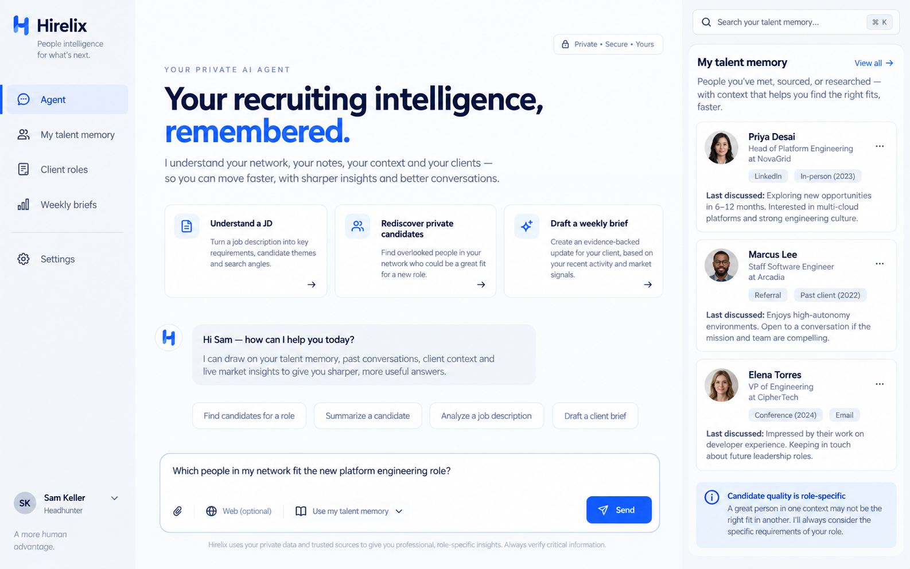
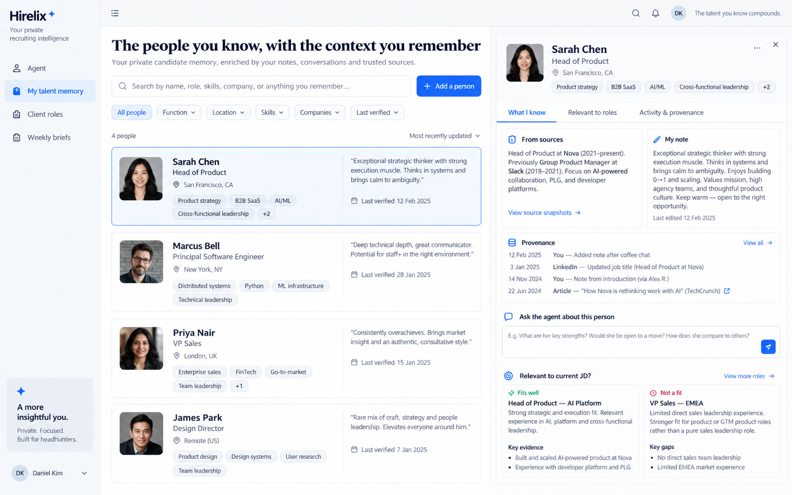
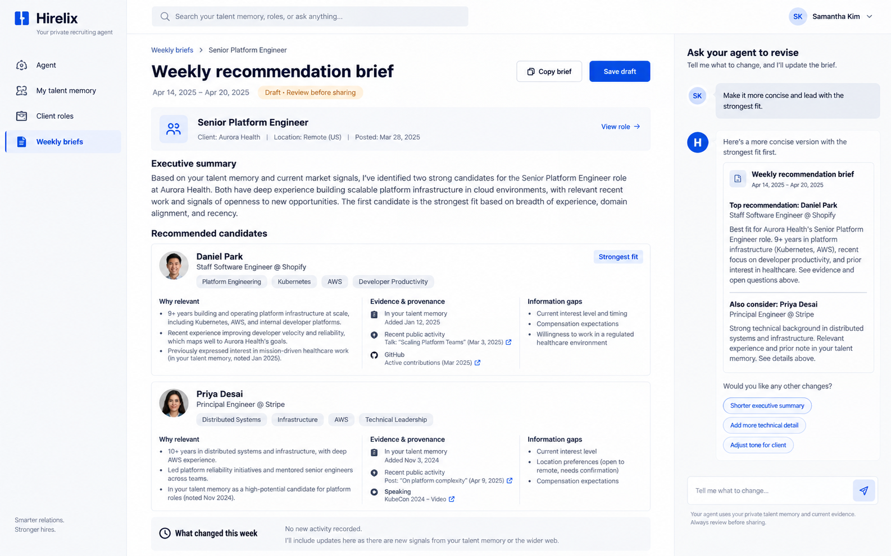

# Hirelix：专业猎头的私人 agent

## 产品判断

Hirelix 的主入口是能持续理解猎头的私人 agent。JD 是当前问题的上下文；长期候选人池是猎头自己的记忆；推荐周报是 agent 依据已有证据写出的工作成果。猎头不需要在这里维护招聘流程或候选人状态。

## 效果图与交互说明

### 1. Agent 首页

对话是首页主体。猎头先选择一个 JD，再询问“我认识的人里谁可能合适”“推荐前还缺什么证据”。右侧提醒 agent 有哪些私人记忆，并始终把候选人判断限定在具体 JD。设计图中的候选人是虚构的视觉示例，不是产品数据。

### 2. 长期候选人记忆

猎头可以主动录入认识的人，写下自己的观察；也可以把一次旧搜索里值得保留的人存入私人记忆。来源信息与猎头笔记分开，保留保存时间。一个人在不同 JD 下可以得到不同判断；记忆本身不存“全局好候选人”标签。

### 3. 推荐周报草稿

猎头选择一个 JD，agent 依据当前私人记忆产出可编辑草稿：简短总结、最多三名可能推荐的人、支持证据、仍需核实的问题，以及本周有无可证实的变化。草稿需人工审阅；没有活动证据时明确写出“本周无已核实变化”。

## 本次实现

- `/app`：私人 agent 对话，可指定 JD；对话按用户保存，推理只读取该用户的记忆和该用户拥有的 JD。
- `/app/talent`：手动保存候选人、从旧搜索保存候选人、编辑私人笔记、检索和删除。即使旧搜索被删除，保存的个人快照仍然存在。
- `/app/briefs`：按 JD 生成周报草稿，编辑、复制和要求 agent 修改；不会自动发送。
- 公开首页改为私人 agent 的定位，旧搜索能力在应用内继续作为补充入口。
- 新增 `hirelix_agent_people`、`hirelix_agent_messages`、`hirelix_agent_briefs`，所有读写按登录用户隔离。旧搜索的 JD 判断仅作为当时来源上下文保存，不变成跨 JD 的候选人质量标签。
- agent 单次回答最多读取最近 120 条私人记忆，并限制发送给模型的文本长度；超出范围时明确告知上下文不完整。较长的笔记与来源材料会截取片段，agent 会收到截取标记。现阶段没有跨全库的语义召回、邮件/日历/LinkedIn 私信集成，也没有自动定时生成周报。

效果图表达目标体验；实际页面和当前功能以运行中的 `/app`、`/app/talent`、`/app/briefs` 为准。

## 验证边界

本地隔离 PostgreSQL、测试登录和真实模型请求验证了添加/保存候选人、按 JD 对话、周报生成与修改、账号隔离，以及桌面和移动端交互。测试中的姓名、JD 和候选人均为本地虚构样本；这些结果不证明真实猎头会采用产品，也不证明大规模候选人池的召回质量。新表迁移仍需在目标环境部署前执行。
